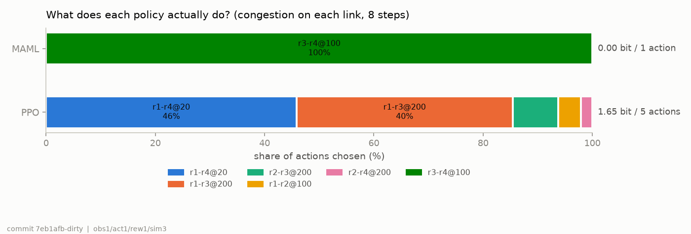
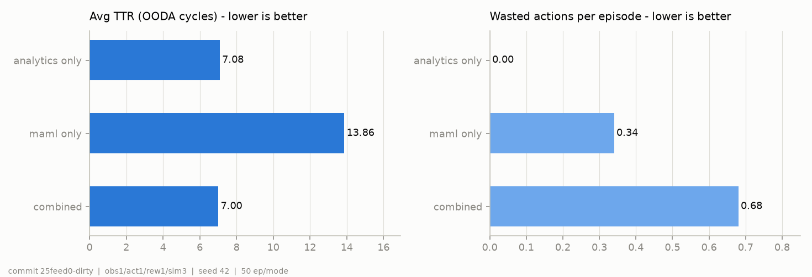

# vagus

## 사람을 거치지 않는 네트워크 폐쇄 루프 — ETSI ZSM/ENI 기반 위협 탐지·자율 복구

> **vagus** — 미주신경. 자율신경계에서 의식적 판단을 거치지 않고 장기의 상태를 감지하고
> 조절하는 경로다. 관측 → 진단 → 조치 → 검증을 사람 없이 닫는다는 점에서 이 시스템이 하는
> 일과 같다.

---

## 한 줄 요약

OSPF 라우팅 하이재킹과 DDoS/포트스캔을 탐지하고, ETSI ZSM/ENI 폐쇄 루프(OODA)로 사람 개입
없이 평균 **6.88 사이클** 안에 복구하는 시스템. 4노드 시뮬레이션 환경에서 50 에피소드 측정,
성공률 100%, 근본 원인 첫 진단 정확도 100%.

**복구를 이끄는 것은 규칙 기반 진단이다.** 강화학습(MAML/PPO) 층을 함께 구현하고 같은
조건에서 측정했지만 아직 기여가 확인되지 않았다 — 절제 실험에서 MAML 단독은 성공률 14%이고,
학습된 정책은 상태와 무관한 상수 행동으로 붕괴한다. 이 결과는 숨기지 않고 그대로 보고하며,
붕괴 여부를 학습 직후 자동 검사하는 게이트를 두고 있다.

---

## 배경 및 동기

5G/6G 환경에서 네트워크 위협은 더 정교해지고 빠르게 진화한다. 기존 보안 시스템은 탐지 후 사람이 직접 대응 절차를 수행하기 때문에, 공격 인지부터 차단까지 수분~수십 분의 대응 공백이 발생한다.

본 시스템은 이 공백을 제거한다.

- **위협 탐지**: OSPF 라우팅 레이어의 LSA 위조 공격, 트래픽 레이어의 DDoS/포트스캔을 AI로 실시간 식별
- **자동 대응**: 탐지 즉시 OSPF cost 재조정 또는 SDN OpenFlow 차단 룰을 자동 생성·적용
- **근본 원인 분석**: SLA 위반 노드의 인접도 점수로 문제 링크를 첫 사이클에 100% 식별

**핵심 연구 질문**

> 라우팅 레이어(OSPF LSA 위조)와 트래픽 레이어(DDoS/포트스캔)의 위협을 AI 단일 파이프라인으로 통합 탐지하고, 사람 개입 없이 평균 6.88 OODA 사이클(2026-09-13 재측정; 이전 3.78은 사이클당 2틱으로 잰 값) 내 자동 복구할 수 있는가?

---

## 탐지하는 위협

### 1. OSPF 라우팅 하이재킹

인증(MD5/crypto) 없는 OSPF 환경에서 위조 LSA를 통해 라우팅 테이블을 조작하는 공격을 탐지한다.

| 공격 유형 | 탐지 규칙 | 조건 |
| --------- | --------- | ---- |
| 출처 위장 | `unknown_router` | 등록되지 않은 라우터 ID |
| 시퀀스 번호 조작 | `seq_jump` | 번호 급등(Δ > 50) 또는 롤백 |
| LSA flooding | `lsa_flood` | 5초 내 3회 이상 재발송 |

### 2. 트래픽 레이어 공격

IsolationForest + 임계치 규칙을 조합해 네트워크 트래픽에서 공격 시그니처를 실시간 추출한다.

| 공격 유형 | 탐지 피처 | 임계치 |
| --------- | --------- | ------ |
| DDoS SYN-flood | `syn_ratio` | ≥ 30% |
| DDoS 대용량 | `pkt_rate` | ≥ 10,000 pps |
| 포트스캔 | `unique_src_count` | ≥ 500 IP / 5s |

### 3. 네트워크 성능 이상 (SLA 위반)

SLA 규칙(지연 > 50 ms 또는 손실 > 1 %)으로 위반 노드를 잡고, 인접도 점수 기반 RCA로 근본 원인 링크를
자동 식별한다. `AnomalyDetector`(IsolationForest)는 Java 경로의 `/anomaly`에서만 판정에 쓰이며
**폐쇄 루프(`/auto-step`)의 Orient에는 관여하지 않는다** — 2026-09-09 감사에서 문서와 코드가
달랐던 부분을 정정했다 (`cowork/AUDIT_2026-09-09.md` P3).

---

## 자동 대응 파이프라인 (OODA)

```
[Observe]   SNMP 메트릭 수집 + 보안 피처 추출
     ↓
[Orient]    위협 인텔리전스 분석
            ├─ OSPF LSA 위조 탐지    (ospf_security.py)
            ├─ 트래픽 공격 탐지      (SecurityAnomalyDetector)
            ├─ 성능 이상 탐지        (diagnose — SLA 규칙)
            └─ 근본 원인 분석 RCA    (root_cause_analysis, ZSM Analytics, Clause 3.1.1.2)
     ↓
[Decide]    MAML few-shot 에이전트 — 최적 대응 행동 결정
            ├─ 라우팅 위협 → OSPF cost 재조정
            └─ 트래픽 공격 → OpenFlow 차단 룰 생성
     ↓
[Act]       대응 자동 실행 (사람 개입 없음)
     ↓
[Evaluate]  AI 모델 성능 자가 진단 + 재학습 필요 여부 판단
            (ZSM AI Model Evaluation, Clause 3.1.1.4)
```

평균 대응 완료까지 **6.88 OODA 사이클** (50 ep, 2026-09-13 재측정, 시뮬레이터 시드 고정). 시뮬레이터의 물리 하한은 cost 적용 후
4틱이고 폐쇄 루프는 1틱 뒤 첫 관측 → 행동이므로 6~7사이클이 사실상 최선이다.
**이전 문서의 3.78은 측정 스크립트가 사이클당 시뮬레이터를 2틱 진행시켜 얻은 값이라 철회한다**
(`cowork/AUDIT_2026-09-09.md` P1, §3).

---

## 시스템 아키텍처

### 계층 구조

| 계층 | 역할 | 구현 |
| ---- | ---- | ---- |
| **Threat Intelligence** | 위협 탐지 + 근본 원인 분석 | `ospf_security.py` + `anomaly_detector.py` |
| **Intelligence** | 최적 대응 행동 결정 | MAML few-shot 에이전트 |
| **Orchestration** | 대응 자동 실행 | OSPF cost 조정 + OpenFlow 룰 |
| **Evaluation** | 모델 자가 진단 | `ModelPerformanceTracker` |

### 상태·행동 공간

- **네트워크 상태** (14차원): `[대역폭×4, 지연×4, OSPF_cost×6]`
- **보안 피처** (3차원): `[syn_ratio, unique_src_count, pkt_rate]`
- **행동 공간** (30차원): `{10, 20, 50, 100, 200} × 6링크`

---

## 프로젝트 구조

```
autonomous-network-mgmt/
├── simulation/
│   ├── metric_generator.py   # 네트워크 메트릭 + 공격 시뮬레이션 (DDoS/포트스캔)
│   └── mock_snmp_agent.py    # REST API + 공격 주입 엔드포인트
│
├── ai-engine/
│   ├── ospf_security.py      # OSPF LSA 위조 탐지 엔진
│   ├── topology.py           # 토폴로지 상수 단일 출처
│   ├── anomaly_detector.py   # SLA 진단 + RCA + IsolationForest(/anomaly 전용) + SecurityAnomalyDetector
│   ├── api_server.py         # FastAPI (위협 탐지·대응 엔드포인트 포함)
│   ├── reward.py             # 보상 함수
│   ├── environment/
│   │   └── network_env.py    # Gym 네트워크 환경
│   └── agents/
│       ├── baseline_drl.py   # Baseline PPO
│       └── few_shot_agent.py # MAML few-shot 에이전트
│
├── experiments/
│   ├── run_experiment.py
│   ├── ablation_study.py
│   └── results/
│
└── docker-compose.yml        # Kafka, PostgreSQL, Redis, Simulation
```

---

## API

### 위협 탐지 (포트 8000)

| 메서드 | 경로 | 설명 |
| ------ | ---- | ---- |
| `POST` | `/ospf/lsa-check` | LSA 위조 실시간 검사 |
| `GET` | `/ospf/security-status` | OSPF 위협 알림 이력 |
| `POST` | `/security/detect` | 트래픽 공격 탐지 + OpenFlow 차단 룰 반환 |
| `GET` | `/security/status` | 통합 보안 상태 조회 |
| `POST` | `/auto-step` | OODA 폐쇄 루프 1 사이클 실행 |
| `GET` | `/diagnose` | 근본 원인 분석 결과 조회 |

### 공격 시뮬레이션 (포트 5001)

| 메서드 | 경로 | 설명 |
| ------ | ---- | ---- |
| `POST` | `/debug/attack/{type}` | 공격 주입 (`ddos` \| `portscan`) |
| `DELETE` | `/debug/attack` | 공격 중지 |
| `POST` | `/debug/fake-lsa` | 위조 LSA 주입 데모 |
| `GET` | `/metrics/security` | 보안 피처 포함 실시간 메트릭 (순수 조회) |
| `POST` | `/debug/tick` | 시뮬레이션 시간 1스텝 진행 — `/auto-step`이 사이클마다 호출 |
| `POST` | `/debug/reset` | 에피소드 리셋, body `{"seed": N}`으로 노이즈 재현 |

**시뮬레이션 시계 (2026-09-09).** 시간은 `POST /debug/tick`으로만 흐른다(`SIM_CLOCK=lockstep`, 기본).
메트릭 조회는 순수 조회라 대시보드·collector·실험 스크립트의 조회가 시뮬레이션을 가속하지 않는다.
주기적으로 관측만 하는 Java 경로 데모에는 `SIM_CLOCK=realtime:1000 python mock_snmp_agent.py`처럼
백그라운드 시계를 켠다. 이전에는 조회마다 시간이 흘러 실험 스크립트의 검증 조회가 사이클당 2틱을
만들었고, 보고된 TTR이 실제의 약 절반이었다 (`cowork/AUDIT_2026-09-09.md` P1).

**보안 범위.** `/debug/*`·`/reset-buffer` 등은 인증이 없고 CORS `*`, `0.0.0.0` 바인딩이며 OSPF 인증 키는
코드에 하드코딩되어 있다. 연구 데모 전용이며 외부 노출을 전제하지 않는다.

---

## 성능 검증

측정 경로가 두 가지이고 **서로 직접 비교할 수 없다.** 인용 시 어느 경로인지 밝힐 것.

| 경로 | 실행 | Analytics override | 타임아웃 |
| ---- | ---- | ------------------ | -------- |
| 폐쇄 루프 | `POST /auto-step` | 포함 | 15 사이클 |
| 오프라인 평가 | `experiments/run_experiment.py` | 없음 (정책 단독) | 200 스텝 |

### 1. 폐쇄 루프 — 자동 대응 속도 (50 에피소드, `/auto-step`)

**2026-09-13 재측정 (사이클당 1틱, 시뮬레이터 시드 고정, seed 42, `results/stress_50ep.json`)**

| 시스템 | Avg TTR | 성공률 | RCA 정확도 (첫/전 사이클) | 부수 피해/ep |
| ------ | ------- | ------ | ------------------------- | ------------ |
| **본 시스템 (MAML + ZSM Analytics)** | **6.88** (TEST 6.75 / TRAIN 7.11) | **100%** | 100% / 100% | 0.70 |

> 최단경로 라우팅 도입(`SIM_VERSION = 3`, ROADMAP B-1) 후, 시뮬레이터 난수까지 시드한 값이다.
> 라우팅 도입 전(cost 역수 근사, sim_v2)에는 6.84 (TEST 6.69 / TRAIN 7.11)였다 — 우회에 대가를 만들어도 폐쇄 루프 TTR은
> 사실상 그대로다. TTR을 정하는 것은 혼잡 링크 격리와 감쇠 대기이기 때문이다.

부수 피해(정상 링크의 cost가 실제로 바뀐 횟수)는 전부 MAML의 2번째 이후 행동이다.

**개정 전 수치 (사이클당 2틱 — 직접 비교 불가, `results/stress_50ep_pre_audit.json`)**

| 시스템 | Avg TTR | 성공률 | RCA 정확도 |
| ------ | ------- | ------ | ---------- |
| MAML v2 + ZSM Analytics | 3.78 | 100% | 100% (첫 사이클만) |
| MAML v1 (Analytics override 이전) | 12.41 | 96.7% | N/A |

측정 스크립트가 `/auto-step` 뒤에 검증용 `/metrics`를 읽을 때마다 시뮬레이터가 1틱 더 흘렀다.
RCA는 2번째 사이클부터 정상 링크를 지목했으나 "첫 사이클 정확도"만 재서 드러나지 않았다.
학습에 없던 링크(TEST)에서도 같은 TTR이지만, 이는 규칙 기반 Analytics의 성질이지 학습 일반화가 아니다.

### 2. 오프라인 평가 — 에이전트 정책 단독 비교 (TEST 링크)

**최신 (2026-09-13, `SIM_VERSION = 3`, TEST 링크 held-out, seed 42, `results/offline_eval.json`)**

| 에이전트 | Avg TTR | 성공률(TTR<30) | 정책 검사 |
| -------- | ------- | -------------- | --------- |
| Baseline PPO (50,000 steps) | **200.0** | **0%** | 붕괴 아님 (행동 6종, 최빈 0.46, 1.65 bit) |
| MAML (샘플링 롤아웃, 500 iter) | **101.93** | **50%** | **붕괴** (상수 `r3-r4@100`, 0 bit) |



*각 링크에 혼잡을 주입하고 8스텝씩 관측한 행동 분포. MAML은 한 덩어리(행동 1종), PPO는
여러 조각으로 갈린다. 재현: `python ai-engine/policy_check.py`*

**어느 쪽도 혼잡 링크를 찾는 정책이 아니다.** MAML의 성공 50%는 상수 행동 `r3-r4@100`이 TEST 링크
둘 중 `r3-r4`와 우연히 일치하는 비율일 뿐이고, PPO는 행동이 다양해졌지만 그중 TEST 링크가 필요로 하는
행동이 없어 양쪽 다 타임아웃한다. 즉 **"붕괴하지 않은 정책"과 "푸는 정책"은 다르다**
(`cowork/ROADMAP.md` §5).

**직전 측정 (sim_v2, `results/*_pre_b1.json`)**: PPO 101.8 / 50%, MAML 101.8 / 50%, 개정 전
MAML 체크포인트 188.6 / 6%. 당시 두 에이전트가 동등해 보였던 것은 **학습에 TEST 링크가 섞여 있었기
때문**이며(2026-09-09 발견·수정), 링크를 실제로 분리하자 200.0 vs 101.81로 갈렸다.

**개정 전 수치 (스텝당 2틱 — 직접 비교 불가)**

| 에이전트 | Avg TTR | 성공률(TTR<30) | 평균 보상 |
| -------- | ------- | -------------- | --------- |
| Baseline PPO (미학습·랜덤) | 200.0 | 0% | 59.7 |
| Baseline PPO (50,000 steps 학습) | 100.9 | 50% | 91.1 |
| MAML (Analytics 미적용) | 139.7 | 32% | 78.0 |

> 미학습 행은 30 에피소드분(`results/summary.json`), 학습 PPO·MAML 두 행은 동일 조건
> 50 에피소드분(`results/offline_eval_trained_ppo_pre_audit.json`, 2026-09-06 실행).

**정정 (2026-09-06)**: 이전 README는 "Baseline 대비 98.1% 대응 시간 단축(200 → 3.78)"이라고
기술했으나, 이는 ① **미학습 랜덤 정책**과 비교한 것이고 ② **측정 경로가 다른** 두 수치를
한 축에 놓은 것이었다. PPO를 50,000 스텝 학습시켜 같은 오프라인 경로에서 재평가하면
**PPO(100.9)가 MAML(139.7)보다 오히려 빠르다.** 따라서 이 주장은 철회한다.

**그렇다면 3.78은 어디서 오는가** — Analytics override다. 아래 절제 실험이 이를 독립적으로
확인한다: Analytics 단독(3.88)이 통합(3.80)과 사실상 같고, MAML 단독은 12.32에 성공률 24%다.
즉 **성능의 동인은 MAML이 아니라 근본 원인 분석 계층**이며, MAML의 기여는 현재 데이터로는
확인되지 않는다.

### Ablation Study — 위협 인텔리전스 계층의 기여

**2026-09-13 재실행 (사이클당 1틱, 에피소드별 seed 고정, `SIM_VERSION = 3`, `results/ablation_study.json`)**

| 모드 | Avg TTR | 성공률 | 부수 피해/ep | RCA 전 사이클 |
| ---- | ------- | ------ | ------------ | ------------- |
| Analytics(위협 인텔리전스)만 | **7.08** | **100%** | **0.00** | 100% |
| MAML만 | 13.86 | 14% | 0.34 | — |
| 통합 (본 시스템) | 7.00 | 100% | 0.68 | 100% |

sim_v2(우회가 공짜였던 모델)에서는 6.94 / 13.80 / 6.94였다 — 결론은 동일하고, 이제
**우회에 대가가 있는 시뮬레이터에서도** 통합이 Analytics 단독 대비 얻는 것이 없음이 확인된다.



*TTR과 부수 피해는 스케일이 달라 한 축에 얹지 않고 패널을 나눴다. 통합(combined)은 Analytics
단독과 TTR이 사실상 같고 정상 링크 cost 변경만 늘어난다.*

**복구는 전부 Analytics가 한다.** 통합은 Analytics 단독과 TTR이 같고 정상 링크 cost 변경만 0.86/ep
늘어난다 — 현재 MAML의 기여는 음(−)이다. MAML 단독 성공 14%는 상수 행동 `r3-r4@100`이 정답인
에피소드(7/50)뿐이다.

개정 전(2026-05-20, 사이클당 2틱): Analytics만 3.88/100%, MAML만 12.32/24%, 통합 3.80/100%
(`results/ablation_study_pre_audit.json`). 결론은 같다.

### CICDDoS2019 실데이터 검증 — SecurityAnomalyDetector

시뮬레이션 값이 아닌 실제 DDoS 트래픽(UNB CICDDoS2019, `Syn.csv`, 430만 행 → 8,699개 1초 윈도우,
BENIGN 3,813 / 공격 4,886)으로 `SecurityAnomalyDetector`를 검증했다.

| 지표 | 기존 집계 (flow_start_window) | 신규 집계 (flow_rate_sum) | 자명한 베이스라인 |
| ---- | ---- | ---- | ---- |
| Precision | 0.65 | 0.58 | 0.56 (= base rate) |
| Recall | **0.12** | **0.54** | 1.00 |
| F1 | 0.20 | **0.56** | **0.72** |


**2026-09-06 — 피처 추출 재설계 결과.** `pkt_rate` 집계를 "플로우 시작 윈도우에 총 패킷수
귀속"에서 "윈도우 내 플로우 전송률(`Flow Packets/s`) 합"으로 교체했다.

**개선된 것**: recall 0.12 → **0.54** (4.5배), F1 0.20 → **0.56** (2.7배).
2026-06-21의 진단이 옳았음이 확인됐다 — 기존 집계가 87µs짜리 공격 플로우(실전송률 약
4만 pps)를 수백 pps로 축소시켜 임계치 10,000 pps를 넘지 못하게 만들고 있었다.

**여전히 해결되지 않은 것**: F1 0.56은 **"전부 공격으로 예측"하는 자명한 베이스라인(0.72)에
못 미친다.** 정확도도 52.1%로 always-attack(56.2%)보다 낮다. 즉 이 탐지기는 아직 실데이터에서
쓸모를 입증하지 못했다. 다만 판정이 "전부 공격"으로 무너진 것은 아니다 — BENIGN 3,813개 중
1,880개(49.3%)를 정상으로 맞혔다. 분리력이 동전 던지기에 가까울 뿐이다.

**남은 원인 (전량 실측):**
1. `SYN Flag Count` 비영 비율 **0.019%** (834 / 4,284,751 공격 플로우) — 이 배포본에서
   `syn_ratio`는 죽은 피처이며 임계치 0.30은 발화하지 않는다
2. `Flow Duration == 0`이라 전송률 계산이 불가해 제외된 플로우 **283,076개(약 6.6%)** —
   SYN flood의 단발 패킷 플로우가 여기 해당해 공격 신호가 계속 새고 있다 (최우선 후속 과제)
3. 결과적으로 탐지는 `pkt_rate` / `unique_src_count` 두 피처에만 의존한다
4. 임계치 재조정으로는 해결되지 않음을 2,500윈도우 그리드서치로 이미 확인 — 세 피처 모두
   "최적" 임계치가 사실상 "전부 공격으로 예측"과 동일했다
5. 재현: `experiments/CICDDOS2019_SETUP.md` → `python validate_security_detector.py
   --csv-path ../data/cicddos2019/Syn.csv --benign-warmup 0 --output cicddos_validation_v2.json`
   (전체 8,699 윈도우, 약 34분 소요)

이 결과는 시뮬레이션 데모의 한계를 실데이터로 드러낸 것으로, 다음 절의 향후 연구 방향에
반영되어 있다.

---

## 핵심 기여

1. **네트워크 위협 통합 탐지**: 라우팅 레이어(OSPF LSA 위조)와 트래픽 레이어(DDoS/포트스캔)를 단일 AI 파이프라인으로 탐지
2. **Zero-Touch 자동 대응**: 탐지 → 대응 전 과정 자동화, 폐쇄 루프 평균 6.88 사이클 내 복구
   (물리 하한 대비 ~1.5배; 2026-09-09 재측정)
3. **위협 인텔리전스 + AI 융합**: 트래픽 공격 탐지(`SecurityAnomalyDetector`)에서 임계치 규칙과 비지도
   IsolationForest를 조합 — 단, 폐쇄 루프의 성능 이상 판정은 SLA 규칙만 사용한다 (2026-09-09 정정)
4. **성능 동인의 정량 규명**: 절제 실험과 베이스라인 재측정으로 복구 성능이 Analytics(RCA)
   계층에서 나오며 MAML의 추가 기여는 확인되지 않음을 실증 — 어느 계층이 실제로 일하는지를
   가린 것 자체가 결과다
5. **링크 무관 복구**: 학습에 없던 링크에서도 동일 TTR — 다만 이는 규칙 기반 Analytics의 성질이지
   학습 일반화의 증거가 아니다 (2026-09-09 정정)
6. **표준 기반 구현**: ETSI ZSM 002 Clause 3.1.1.2~3.1.1.4 완전 구현 및 정량 검증

---

## 한계 및 향후 연구

### 한계

- Mininet 시뮬레이션 기반 — 실제 하드웨어 환경 검증 필요
- **MAML의 기여가 확인되지 않음 — 오히려 음(−)** — 절제 실험에서 Analytics 단독(6.94)과 통합(6.94)의
  TTR이 같고 통합은 정상 링크 cost 변경만 0.86/ep 더 한다. 복구 성능은 근본 원인 분석 계층이
  만들어낸다 (위 "성능 검증" 절 참고)
- **정책 붕괴는 학습 초반에 일어난다** (2026-09-13) — 학습 중 행동 분포를 기록해 보니 MAML은
  전체의 24%(iter 120/500), PPO는 16%(8,192/50,000 스텝) 지점에서 붕괴한다. PPO는 회복하고
  MAML은 iter 260 이후 갇혀, **MAML 학습의 뒤쪽 절반은 이미 죽은 정책 위에서 돈다.**
  학습량을 늘리는 것으로는 해결되지 않는다 (`cowork/ROADMAP.md` §5, 도판 `T1_train_collapse`)
- **학습된 정책이 혼잡 링크를 찾지 못한다** (2026-09-09) — MAML은 상수 `r3-r4@100`으로 붕괴해 있고,
  PPO는 최단경로 라우팅 도입 후 붕괴를 벗어났지만 TEST 링크 성공률이 0%다. 관측이 링크를 특정하지
  못하는 것(노드 평균만 보임)이 핵심 원인으로 보이며, 관측·행동·보상 재설계 없이는 RL 계층의 의미를
  평가할 수 없다 (`cowork/ROADMAP.md` Track A)
- **과거 오프라인 비교에 학습/평가 링크 누수가 있었다** (2026-09-09 발견·수정) — 재학습 파이프라인이
  TEST 링크까지 학습에 넣어 PPO·MAML이 동등해 보였다. 링크 분리 후 결과가 갈렸다
- **행동 공간에 NO-OP이 없음** — 오프라인 평가/PPO 학습에서 정상 상태에도 매 스텝 cost를 바꿔야 한다.
  공개 시그니처(30 행동)라 보류
- **`SecurityAnomalyDetector`는 레이블 없이 모든 샘플로 학습** — 공격이 지속되면 공격을 정상으로
  학습하며, `contamination=0.05`는 CICDDoS2019 공격 비율 0.56과 맞지 않는다 (튜닝하지 않고 기록)
- 시뮬레이터에 "정답 행동"(혼잡 링크 cost ≥ 100)이 명시적으로 코딩되어 있어, 규칙 기반
  Analytics가 100% 정확한 것은 어느 정도 예정된 결과 — 난이도가 높은 시나리오 필요
- **CICDDoS2019 실데이터에서 탐지기가 자명한 베이스라인을 넘지 못함** — 피처 추출 재설계로
  recall 0.12 → 0.54까지 올렸으나, F1 0.56은 여전히 "전부 공격 예측"(0.72)보다 낮다.
  실데이터 유용성은 아직 입증되지 않았다 (위 "성능 검증" 절 참고)
- OSPF 보안 탐지는 규칙 기반 — ML 기반 시퀀스 패턴 학습 미적용
- 단일 혼잡/공격 시나리오 — 다중 동시 위협 미검증

### 향후 연구 방향

- ~~**트래픽 보안 피처 추출 방식 재설계**~~ — 1차 완료 (`Flow Packets/s` 합산 집계로 교체,
  recall 0.12 → 0.54). 다만 베이스라인 미달로 후속 과제가 남음:
  - `Flow Duration == 0` 플로우 283,076개(6.6%)의 전송률 처리 — 현재 제외 중이며
    SYN flood 단발 패킷이 여기 해당해 신호가 샌다 **(최우선)**
  - `syn_ratio`를 대체할 피처 발굴 — 이 배포본의 `SYN Flag Count`는 사실상 전부 0.
    응답 없는 단방향 플로우 비율(`Total Backward Packets == 0`) 등이 후보
  - 윈도우 귀속 방식 개선 — 플로우를 `[start, start+duration]` 구간에 겹침 비율로 분배
  - raw pcap 기반 초당 패킷수 직접 추출 (근본 해법)
- DBD/LSDB 확장과 연계한 LSA 전파 경로 이상 탐지 고도화
- ~~OSPF MD5/SHA 인증 우회 시나리오 추가~~ — 완료 (`ospf_security.py`의 `verify_auth`/
  `check_lsa_authenticated` + replay/downgrade/key-compromise 3종 시나리오)
- 실제 SDN 컨트롤러(OpenDaylight/ONOS) 연동으로 OpenFlow 차단 룰 실제 적용
- Graph Neural Network 기반 상태 표현으로 대규모 토폴로지 확장
- 다중 도메인 위협 인텔리전스 공유 시나리오

---

## 개발 일지

날짜순으로 정리한 진행 이력. 최신 작업이 맨 아래에 온다.

### 2026-05-06 — 프로젝트 시작
- Mininet 가상 토폴로지, SNMP 메트릭 시뮬레이션, MAML/PPO 에이전트 등 핵심 골격 구축
- GitHub Pages용 데모 대시보드 추가

### 2026-05-13 — 문서 정리
- README 초기 정리

### 2026-05-20 — Ablation Study
- Analytics vs MAML 기여도 분석(50 에피소드) 추가 — Analytics 계층이 핵심 성능 동인임을 최초 실증

### 2026-06-05 — 레포지토리 이전
- `autonomous-network-mgmt` → `autonomous-network`로 origin 변경, 스냅샷 재초기화

### 2026-06-18 — 보안 탐지 1차 도입
- OSPF LSA 위조 탐지(`ospf_security.py`) 최초 구현 — 미등록 라우터 ID / 시퀀스 점프 / LSA flooding 3규칙
- 트래픽 기반 보안 탐지(`SecurityAnomalyDetector`) 추가 — DDoS/포트스캔 탐지(시뮬레이션 데이터 기준)
- README를 "위협 인텔리전스 + Zero-Touch 자동 대응" 플랫폼으로 재포지셔닝

### 2026-06-20 — 인증 강화 + 실데이터 검증 착수
- OSPF MD5/SHA256 인증(RFC 2328 Appendix D / RFC 5709) 검증 로직 + 재생·다운그레이드·키유출 우회 시나리오 3종 추가
- CICDDoS2019 데이터셋 연동 파이프라인(`cicddos_loader.py`, `validate_security_detector.py`) 구축
- 실데이터 첫 검증 결과: precision 0.65, recall 0.12 — 시뮬레이션 임계치가 실제 트래픽에는 안 맞는다는 것을 발견

### 2026-06-21 — 검증 결과 진단 및 시각화
- recall이 낮은 근본 원인 진단: 임계치 문제가 아니라 피처 추출 방법론 문제(`SYN Flag Count` 컬럼 손상, 플로우 시작시각 기준 윈도우링의 한계) — 임계치 재조정은 무의미함을 그리드서치로 확인
- 탐지 과정 시각화(rolling F1 학습 곡선, cold-start 구간 표시) 추가 — 시간이 지나도 성능이 베이스레이트를 회복하지 못함을 시각적으로 증명
- 검증 결과를 README "성능 검증"/"한계 및 향후 연구"에 정직하게 반영

### 2026-09-06 — 피처 추출 재설계 + 베이스라인 정정
코드 감사에서 나온 문제들을 정리한 작업. **좋은 소식보다 나쁜 소식이 많았고, 그대로 기록한다.**

- **피처 추출 재설계 (부분 성공)**: `pkt_rate`를 `Flow Packets/s` 합산으로 교체 —
  recall 0.12 → 0.54, F1 0.20 → 0.56. 6-21의 진단은 옳았다. 그러나 F1이 여전히
  "전부 공격 예측" 베이스라인(0.72)에 못 미쳐 **문제는 해결되지 않았다.**
  `Flow Duration == 0` 플로우 6.6%가 제외되는 것이 남은 최대 누수
- **베이스라인 정정 (주장 철회)**: PPO를 50,000 스텝 학습시켜 동일 조건에서 재평가한 결과
  학습된 PPO(TTR 100.9)가 MAML(139.7)보다 빨랐다. 기존 "98.1% 단축"은 미학습 랜덤 정책과의
  비교였고 측정 경로도 달랐다 — **철회.** 절제 실험과 종합하면 성능 동인은 Analytics 계층이며
  MAML의 기여는 확인되지 않는다. 근거 없던 "500배 샘플 효율" 문구도 삭제
- **Java 제어 경로 복구**: 관측 차원 불일치(12 vs 14)로 `/action`이 항상 실패하고,
  정규화된 값에 SLA(50ms) 규칙을 적용해 `/anomaly`가 영구히 발화하지 않던 문제를 수정.
  뿌리는 "수집 계층과 AI 엔진의 정규화 규약 불일치" 하나였다
- **측정 조건 표기**: 오프라인 평가와 `/auto-step` 폐쇄 루프 수치가 한 축에서 비교되던 문제 —
  결과 JSON에 `_condition`을 남기고 ablation 수치를 50 에피소드 실행분으로 통일
- 대시보드가 라이브 데이터를 읽지 않는 정적 데모임을 명시, 미사용 의존성(learn2learn) 제거

### 2026-09-09 — 코드 감사 2차: 측정 방법론 결함 수정
`cowork/AUDIT_2026-09-09.md`에 20건을 기록하고 A1–A7로 수정. **이번에도 나쁜 소식이 더 많다.**

- **시뮬레이션 시간이 관측 호출로 흘렀다** — 실험 스크립트의 검증 조회 때문에 사이클당 2틱이 진행됐고,
  보고된 TTR 3.78은 실제 사이클 수의 약 절반이었다. 시뮬레이터에 명시적 `tick()`을 두고 재측정:
  **TTR 6.84** (물리 하한 4틱 + 관측 지연). 이전 수치는 `*_pre_audit.json`으로 보존
- **RCA가 2번째 사이클부터 정상 링크를 지목** — "RCA 정확도 100%"는 첫 사이클만 잰 값이었다.
  규칙을 고치고 전 사이클 정확도·부수 피해 지표를 추가: analytics-only 부수 피해 112회/50ep → 0회
- **MAML 학습 롤아웃에 탐색이 없었고 지지 버퍼에 실행하지 않은 행동이 기록됐다** — 수정·재학습했으나
  결과는 **PPO와 같은 상수 정책**(`r3-r4@100`). 세 체크포인트 모두 상태 무관 상수 행동임을 확인 —
  "PPO vs MAML" 비교는 두 상수의 비교였다
- **폐쇄 루프 Orient는 IsolationForest를 쓰지 않는다** — 문서를 정정 (SLA 규칙 + RCA)
- **관측 실패가 '정상'으로 대체됐다** — 503으로 변경. Java 경로도 이상 판정 실패를 전파하고
  전 노드 정상이면 행동하지 않음
- `SecurityAnomalyDetector` 판정 순서(detect→update) 수정, IsolationForest 재학습 주기화,
  토폴로지 상수 단일화(`topology.py`), JPA/PostgreSQL 의존성 제거, `requirements.txt`를 체크포인트
  환경(numpy 2 / SB3 2.8)에 맞춤, 임시 체크포인트 git 제거

### 2026-09-13 — 데모 대시보드가 그리던 철회된 수치 제거
공개 페이지(GitHub Pages)가 2026-04-22에 하드코딩된 값을 계속 그리고 있었다. 차트 7개를
전부 내리고 다시 짰다 — 상세는 `cowork/VISUALIZATION_PLAN.md` §8.

- **샘플 효율 차트 3종 삭제** — "500배 샘플 효율" 문구는 이미 철회했는데 그 근거로 쓰이던
  그림은 남아 있었다. 탭 자체를 **학습 동역학**(행동 엔트로피·최빈 행동 점유율 곡선,
  체크포인트 붕괴 현황)으로 교체
- **수치를 페이지에 손으로 적지 않는다** — `experiments/make_dashboard_data.py`가
  `results/*.json`에서 `dashboard_data.js`를 생성하고, `reproduce.sh`가 도판 직후에 부른다.
  결과·도판·대시보드가 같은 실행에서 갱신되므로 셋이 어긋날 수 없다
- **조건 스탬프** — 각 탭 머리에 커밋·계약 버전·seed·측정 조건을 병기. 도판에 요구하는 것을
  대시보드에도 요구한다
- `scripts/dashboard_smoke.js` 추가 (`selftest.sh`에 편입) — 실제 결과 값으로 모든 차트가
  그려지는지, 이중축이나 범례 없는 다계열이 없는지, 화면의 KPI가 결과 파일과 같은지 검사.
  Chart.js CDN이 막힌 환경에서 표·KPI까지 비던 문제도 이 과정에서 발견해 고쳤다

### 2026-09-17 — 리포지토리 이름 변경: `autonomous-network` → `vagus`
이전 이름은 너무 일반적이어서 이 프로젝트를 다른 것과 구별해 주지 못했다.

- **vagus**(미주신경)는 자율신경계에서 의식적 판단을 거치지 않고 장기 상태를 감지·조절하는
  경로다. 관측 → 진단 → 조치 → 검증을 사람 없이 닫는 이 시스템의 구조와 같다
- README 제목을 측정 결과에 맞췄다. 이전 제목("AI 기반 ... 자율 대응 시스템")과 한 줄 요약은
  복구를 AI가 수행하는 것처럼 읽혔지만, 절제 실험이 보여주는 것은 **규칙 기반 진단이 복구를
  이끌고 강화학습 층의 기여는 아직 확인되지 않았다**는 사실이다. 한 줄 요약에 그대로 적었다
- GitHub Pages 주소가 `wer134.github.io/vagus/`로 바뀐다

---

## 관련 문서

- `autonomous-network-mgmt/cowork/PROJECT_OVERVIEW.md` — 코드 구조·런타임 설명서
- `autonomous-network-mgmt/cowork/AUDIT_2026-09-09.md` — 코드 감사 보고서와 전/후 측정치
- `autonomous-network-mgmt/cowork/ROADMAP.md` — 고도화 계획 (트랙별 과제, 단계, 완료 기준)
- `autonomous-network-mgmt/cowork/VISUALIZATION_PLAN.md` — 시각화 계획 (도판 카탈로그, 대시보드 정리)

## 관련 표준

- [ETSI GS ZSM 002](https://www.etsi.org/deliver/etsi_gs/ZSM/001_099/002/) — Zero-touch network and Service Management
- [ETSI GS ENI 007](https://www.etsi.org/deliver/etsi_gs/ENI/001_099/007/) — Experiential Networked Intelligence
