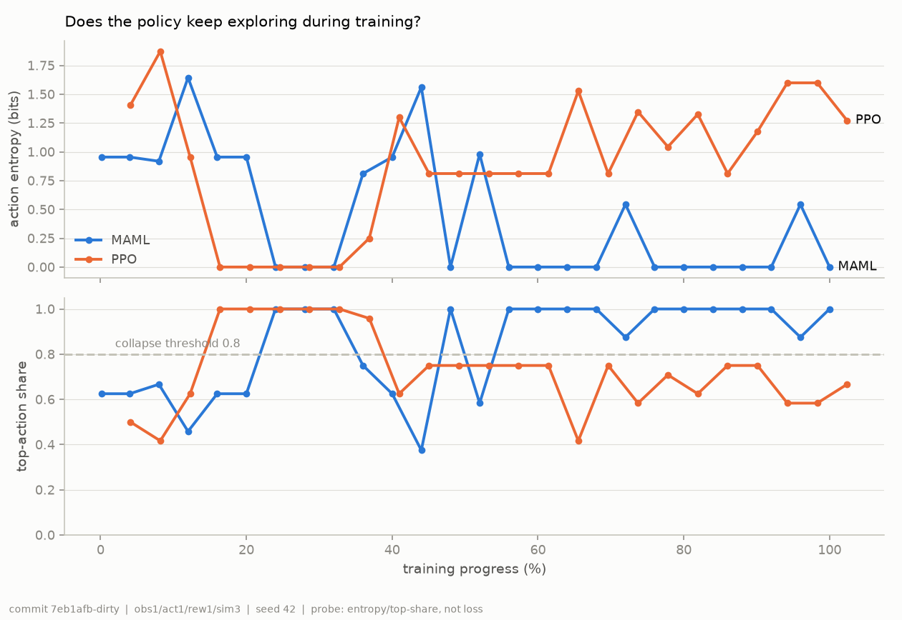

# 고도화 계획서 (ROADMAP) — autonomous-network-mgmt

> 작성일: 2026-09-09
> 선행 문서: `PROJECT_OVERVIEW.md`(구조), `AUDIT_2026-09-09.md`(감사·수정 결과), `FIX_PLAN.md`(2026-09-06 지시서)
> 대상: 이 프로젝트를 "동작하는 연구용 프로토타입"에서 "주장을 뒷받침할 수 있는 시스템"으로 올리기 위한
> 향후 6~12개월 과제. 우선순위는 **현재 결과에서 무엇이 입증되지 않았는가**를 기준으로 정했다.

---

## 0. 출발점 — 지금 무엇이 입증됐고 무엇이 아닌가

두 차례 감사(09-06, 09-09)를 거친 뒤의 정직한 상태다. 고도화는 여기서 출발해야 한다.

| 주장 | 상태 | 근거 |
| --- | --- | --- |
| 폐쇄 루프가 혼잡 링크를 첫 사이클에 식별하고 자동 복구한다 | **입증** (시뮬레이션 내) | stress 50 ep: RCA 100%, 성공 100%, TTR 6.86 (sim_v3; 물리 하한 4틱 + 관측 지연) |
| 복구 성능의 동인은 Analytics(RCA) 계층이다 | **입증** | 절제: analytics_only 7.08 ≈ combined 6.90, 부수 피해 0 vs 0.86 (sim_v3에서도 유지) |
| MAML few-shot 에이전트가 복구에 기여한다 | **반증** — 현재 기여는 음(−) | combined는 TTR 이득 없이 정상 링크만 건드림 |
| PPO/MAML이 상태에 따라 링크를 고르는 정책을 학습했다 | **반증** | MAML은 sim_v3에서도 상수(P8). PPO는 sim_v3에서 붕괴를 벗어났으나 TEST 링크 성공률 0% — §6 참고 |
| 트래픽 공격 탐지기가 실데이터에서 유용하다 | **미입증** | CICDDoS2019 F1 0.56 < 전부-공격 베이스라인 0.72 |
| OSPF 인증·위조 탐지 | 규칙 기반으로 **동작** | 자가 테스트 4종 통과. ML 없음 |
| Java 마이크로서비스 경로(A) | 컴파일만 검증 | Kafka 실기동 미검증 |
| 실제 네트워크(Mininet/OSPF 데몬)에서 동작 | **없음** | `topology.py`는 미사용 참조 구현 |

핵심 진단: **"AI 기반 자율 복구"라는 이름과 달리 지금 일하는 것은 규칙 기반 Analytics다.** RL 계층이
의미를 가지려면 (1) 에이전트가 링크를 특정할 수 있는 관측, (2) 행동 차이가 보상 차이로 이어지는
학습 신호, (3) 규칙이 못 푸는 시나리오가 필요하다. 세 가지 모두 현재 설계에 없다.

---

## 1. 원칙

`FIX_PLAN.md` §0.2를 계승한다. 고도화 과정에서도:

1. 지표가 좋아 보이도록 임계치·하이퍼파라미터를 조정하지 않는다. 조정하면 전/후를 모두 기록한다.
2. 결과 파일은 스크립트 출력으로만 갱신한다. 이전 결과는 `*_pre_<태그>.json`으로 보존한다.
3. 개선이 있어도 기존 한계 서술을 지우지 않는다.
4. **새 기능마다 "이것이 없으면 못 푸는 시나리오"를 먼저 정의한다.** 규칙으로 100% 풀리는 문제에
   학습 모델을 얹는 것은 기여가 아니다 (절제 실험이 이미 보여줬다).
5. 관측·행동·보상 등 계약을 바꿀 때는 버전을 붙인다(`obs_v2`, `action_v2`). 구 체크포인트와 결과는
   구 버전으로 남긴다.
6. 측정 방법을 먼저 고정하고 모델을 바꾼다 (P1의 교훈: 자를 바꾸면 모든 수치가 무효가 된다).

---

## 2. 트랙별 과제

### Track A — RL 계층의 의미 회복 (최우선)

**문제.** 세 정책 전부 상수 행동(P8). 오프라인 평가·절제 실험의 RL 관련 수치는 정책 품질을 재지 못한다.

**원인 분석 (코드 기준).**

| 원인 | 위치 | 설명 |
| --- | --- | --- |
| 관측이 링크를 특정하지 못함 | `network_env.py` 관측 14차원 = 노드 bw×4, lat×4, cost×6 | 링크 스트레스는 인접 노드 평균으로만 보인다. r3-r4 혼잡과 r3·r4 각각의 다른 링크 혼잡을 구분하려면 노드 쌍 패턴을 학습해야 하는데 신호가 약하다 |
| 학습 중 행동이 보상을 바꾸는 스텝이 드묾 | `ANOMALY_PROB = 0.03`, 최대 2개 동시 | 200스텝 에피소드에서 이상은 평균 6회 시작. 나머지 스텝은 어떤 행동이든 보상이 거의 같다 |
| 행동 비용이 없음 | `reward.py` | 정상 링크의 cost를 바꿔도 패널티가 없다. 상수 행동이 손해 보지 않는다 |
| NO-OP 없음 | 행동 30개 전부 cost 변경 | "아무것도 하지 않음"을 표현할 수 없어 정상 상태에서도 교란한다 (P7) |
| MAML 태스크 분포가 사실상 하나 | `train()`이 같은 env로 4 태스크 | 태스크 간 차이가 링크 선택뿐이라 meta-learning의 전제(태스크 분포)가 약하다 |

**과제.**

| ID | 과제 | 구체 변경 | 완료 기준 |
| --- | --- | --- | --- |
| A-1 | 관측 v2: 링크 단위 지표 추가 | 관측에 링크별 이용률(또는 SNMP `ifInOctets` 대응값) 6개 추가 → 20차원. 실제 SNMP는 인터페이스 단위이므로 현실성 훼손이 아니다. `obs_version` 필드로 v1/v2 구분 | `NetworkEnv(obs_version=2)`, `/action` 페이로드에 `linkUtil` 선택 필드, v1 호환 유지 |
| A-2 | 행동 v2: NO-OP 추가 | `Discrete(31)`, 인덱스 30 = 무행동. `action_version` 명시. 폐쇄 루프는 이미 "이상 없으면 무행동"이므로 오프라인 경로만 영향 | 오프라인 평가에서 정상 상태 스텝의 cost 변경률 < 5% |
| A-3 | 보상 v2: 행동 비용 + 부수 피해 패널티 | `R -= w_act × 1[cost 변경]`, `R -= w_side × (정상 링크 변경 수)`. 가중치는 **한 번 정하고 고정**, 전/후 기록 | 상수 정책의 보상이 no-op 정책보다 낮아짐을 자가 테스트로 확인 |
| A-4 | 학습 커리큘럼 | 에피소드 시작 시 혼잡 1개 확정 주입 + 확률적 추가 주입, 에피소드 길이 50. "행동이 보상을 바꾸는" 스텝 비율 ≥ 50% | 학습 로그에 anomaly-active 스텝 비율 출력 |
| A-5 | 정책 붕괴 게이트 | `policy_collapse_check.py`를 학습 파이프라인 마지막 단계로 편입. 상수 비율 > 80%면 체크포인트를 "붕괴"로 표시하고 결과 문서에 자동 기록 | 모든 결과 JSON에 `policy_entropy`, `top_action_share` 포함 |
| A-6 | 규칙이 못 푸는 시나리오 도입 | (a) 동시 혼잡 2~3개 (RCA 폴백 규칙이 추정에 그치는 영역), (b) cost 변경이 다른 링크로 혼잡을 옮기는 용량 제약(Track B-2), (c) 노이즈 큰 관측 | 각 시나리오에서 analytics_only 성공률 < 100%가 되어야 RL 기여를 측정할 공간이 생긴다 |
| A-7 | 공정 비교 프로토콜 | PPO·MAML을 같은 obs/action/reward v2, 같은 seed 5개, 같은 스텝 예산으로 학습. 오프라인·폐쇄 루프 각각에서 analytics_only / +PPO / +MAML 절제. 지표: TTR, 성공률, 부수 피해, 상수 비율 | seed 5개 평균±표준편차로 보고. 단일 seed 수치 금지 |

**예상 결과에 대한 솔직한 전망.** A-1~A-4를 해도 단일 혼잡 시나리오에서는 규칙(RCA)이 계속 이길
가능성이 높다. RL의 자리는 A-6의 "규칙이 모호한" 영역이다. 거기서도 이득이 없으면 RL 계층을 제거하고
Analytics 중심 시스템으로 재포지셔닝하는 것이 정직한 결론이며, 그 결론도 기여다.

### Track B — 시뮬레이터 현실성

**문제.** 정답 행동(cost ≥ 100 → 즉시 격리)이 코딩되어 있고, 용량·방향·트래픽 매트릭스가 없다.
분석 계층이 100%인 것은 이 단순함의 결과다.

| ID | 과제 | 구체 변경 | 완료 기준 |
| --- | --- | --- | --- |
| B-1 | 트래픽 매트릭스 + 최단경로 라우팅 | 노드 쌍별 수요 행렬, OSPF cost로 Dijkstra 경로 계산, 링크 부하 = 경로가 지나는 수요의 합. 지금의 "cost 역수 비율" 근사를 대체 | cost 변경이 **다른 링크의 부하를 올리는** 부작용이 재현됨 |
| B-2 | 링크 용량 | 링크별 용량(Mbps), 이용률 = 부하/용량, 스트레스는 이용률의 함수. 우회가 항상 공짜가 아니게 됨 | 우회 경로가 포화되는 시나리오 존재 |
| B-3 | 다중 동시 이벤트 | 혼잡 2~3개, 혼잡 + 공격, 링크 다운(용량 0) | RCA 폴백 규칙의 정확도를 처음으로 측정 |
| B-4 | 관측 지연·손실 | SNMP 폴링 주기 모사(관측이 n틱 지연), 관측 누락 확률 | 503 처리 경로(A4)가 실제로 쓰임 |
| B-5 | 시뮬레이터 자가 테스트 확장 | 시정수, 용량 포화, 라우팅 정합성 등을 `metric_generator.py __main__`에 추가 | 자가 테스트가 회귀를 잡음 |
| B-6 | Mininet + FRR(OSPF 데몬) 실연동 | `topology.py`를 OVS 스위치가 아닌 FRR 라우터 컨테이너로 재작성. `MininetClient.setOspfCost`가 실제 `vtysh` 명령으로 cost 변경. 메트릭은 실제 인터페이스 카운터 | 실제 OSPF 재수렴 시간이 TTR에 포함됨. Linux 전용, Docker `privileged` |

B-1~B-3은 Python만으로 가능하고 Track A의 전제다. B-6은 별도 마일스톤(Phase 3).

### Track C — 트래픽 공격 탐지기의 실데이터 유효성

**문제.** F1 0.56 < 베이스라인 0.72. 원인은 피처(문서화됨)와 모델 구조(P4) 둘 다.

| ID | 과제 | 구체 변경 | 완료 기준 |
| --- | --- | --- | --- |
| C-1 | `Flow Duration == 0` 플로우 처리 | 제외 대신 "패킷 수 / 최소 시간 단위"로 전송률 추정하거나 별도 피처(`zero_duration_flow_count`)로 분리 | 제외 플로우 0건, 결과 전/후 병기 |
| C-2 | 대체 피처 | `syn_ratio`(죽은 피처) 대신 단방향 플로우 비율(`bwd_packets == 0`), 플로우 수/초, 평균 플로우 길이. `update()/detect()` 6인자 시그니처는 v1으로 유지하고 v2 API 추가 | 피처별 단변량 AUC 보고 |
| C-3 | 지도학습 베이스라인 | 로지스틱 회귀·GBM을 같은 윈도우 피처로 학습(시간 순 분할: 앞 70% 학습, 뒤 30% 평가). 비지도 IF가 이 베이스라인과 얼마나 차이 나는지 보고 | 결과 표에 IF / LR / GBM / 전부-공격 4행 |
| C-4 | 온라인 학습 게이팅 | `is_threat=True`로 판정한 샘플은 학습 버퍼에 넣지 않음(자기 강화 방지). contamination은 데이터의 추정 base rate로 설정하되 **전/후 기록** | 지속 공격 200윈도우 후에도 탐지율 유지 (시뮬레이션으로 검증) |
| C-5 | 데이터셋 확장 | CICDDoS2019 다른 공격일 CSV, CIC-IDS2017(포트스캔 포함) — 포트스캔 분기의 첫 실검증 | 공격 유형별 혼동 행렬 |
| C-6 | 재현 자동화 | 데이터 준비 스크립트 + 결과 파일 스키마 버전(`schema_version`) | `python validate_security_detector.py --all` 한 번으로 전 표 재생성 |

### Track D — 운영 파이프라인

| ID | 과제 | 구체 변경 | 완료 기준 |
| --- | --- | --- | --- |
| D-1 | Java 경로 실기동 검증 | Docker Compose로 Kafka + 시뮬레이터(`SIM_CLOCK=realtime:1000`) + collector + orchestrator + AI 엔진 기동, 혼잡 주입 → cost 변경까지 E2E | compose 프로파일 `e2e`, 검증 스크립트가 30초 내 cost 변경 확인 |
| D-2 | 제어 경로 단일화 | (A) Java 경로가 `/action`(단건) 대신 `/auto-step`을 호출하거나, (B) `/auto-step`의 Orient·Decide 로직을 라이브러리로 분리해 두 경로가 공유. 현재는 같은 목적의 루프가 두 벌(§3.2 OVERVIEW) | 절제 실험 결과가 두 경로에서 같음 |
| D-3 | 메트릭·결정 이력 저장 | PostgreSQL 재도입(이번엔 코드와 함께): 관측, 진단, 행동, 결과를 시계열로 저장. 대시보드 라이브화의 전제 | `/history?from=&to=` API |
| D-4 | 대시보드 라이브화 | 정적 데모 대신 `/live-results`·`/history`를 읽는 프런트. 정적 버전은 GitHub Pages용으로 유지 | 라이브/정적 빌드 분리 |

> 도판·대시보드 작업의 상세 계획은 `cowork/VISUALIZATION_PLAN.md`에 있다. 특히 현재 대시보드가
> 철회된 수치(TTR 3.78, 랜덤 정책 베이스라인, 샘플 효율 곡선)를 렌더링하고 있다는 점을 다룬다.
| D-5 | 관측성 | 구조화 로그(JSON), 사이클별 지연·실패 카운터, `/metrics`(Prometheus) | 503·apply 실패가 카운터로 보임 |
| D-6 | 접근 제어 | `/debug/*`·`/reset-buffer`에 토큰, CORS 화이트리스트, OSPF 키를 환경변수/키스토어로 | README 보안 범위 절 갱신 |

### Track E — 품질 인프라

| ID | 과제 | 구체 변경 | 완료 기준 |
| --- | --- | --- | --- |
| E-1 | 자가 테스트 러너 | `scripts/selftest.sh`: `metric_generator`, `anomaly_detector`, `topology`, `ospf_security`, `cicddos_loader` `__main__` 순차 실행 + `policy_collapse_check` + `mvn -q compile`. pytest 도입은 owner 결정 사항 | 한 명령으로 전부 통과/실패 |
| E-2 | CI | GitHub Actions: E-1 + FastAPI TestClient로 `/auto-step` 503 경로·정상 경로 스모크. 학습·실험은 CI 밖 | PR마다 실행 |
| E-3 | 재현 파이프라인 | `experiments/reproduce.sh`: MAML/PPO 학습(seed 목록) → 오프라인 평가 → 서버 기동 → 폐쇄 루프 3종 → 결과 요약 표 생성. 이번 세션의 임시 `pipeline.sh`를 정식화 | README의 모든 수치가 이 스크립트 출력과 일치 |
| E-4 | 결과 파일 규약 | 모든 결과 JSON에 `schema_version`, `_condition`, `seed`, `git_commit`, `obs/action/reward_version` | 결과 파일만 보고 측정 조건을 알 수 있음 |
| E-5 | 체크포인트 관리 | 체크포인트 파일명에 버전·날짜·커밋(`maml_v2_20261001_abc123.pt`), `agents/MANIFEST.md`에 학습 조건 기록. 운영 체크포인트 심볼릭 이름은 매니페스트로 해석 | 체크포인트-결과-커밋 추적 가능 |

### Track F — 연구 포지셔닝

현재 데이터로 정직하게 주장할 수 있는 것과 없는 것을 분리한다.

| 주장 가능 (지금) | 주장하려면 필요한 것 |
| --- | --- |
| ETSI ZSM 폐쇄 루프(Observe–Orient–Decide–Act–Evaluate)의 참조 구현과 절제 실험 방법론 | — |
| 인접도 기반 RCA가 단일 혼잡을 첫 사이클에 100% 식별 (시뮬레이션) | 다중 혼잡·용량 제약(B-1~B-3)에서의 정확도 |
| "RL 계층의 기여를 절제 실험으로 분리해 음(−)임을 확인" — 부정적 결과 자체가 기여 | — |
| OSPF 인증 우회 시나리오 3종의 규칙 기반 탐지 | ML 시퀀스 모델과의 비교 |
| 측정 방법론 결함(관측 주도 시간, 첫 사이클만 재는 RCA 정확도)의 발견과 수정 | — |
| MAML few-shot 적응의 이점 | Track A 전부 + A-6 시나리오에서 유의한 이득 |
| 실데이터 DDoS 탐지 | Track C-1~C-4에서 베이스라인 초과 |

---

## 3. 단계별 로드맵

### Phase 1 (1~2개월) — 자를 고정하고 학습 문제를 풀 수 있게 만든다

- E-1, E-3, E-4 (측정·재현 인프라 먼저)
- B-1, B-2, B-3 (시뮬레이터에 트래픽 매트릭스·용량·다중 이벤트)
- A-1, A-2, A-3, A-4, A-5 (관측/행동/보상 v2, 커리큘럼, 붕괴 게이트)
- C-1, C-4 (탐지기의 가장 큰 누수와 자기 강화 차단)

**완료 기준**: `reproduce.sh` 한 번으로 모든 표가 재생성되고, 학습된 정책의 상수 비율이 80% 아래로
내려가며, 다중 혼잡 시나리오에서 analytics_only 성공률이 100% 미만인(=RL이 기여할 공간이 있는)
벤치마크가 존재한다.

### Phase 2 (3~4개월) — 기여를 측정한다

- A-6, A-7 (규칙이 모호한 시나리오에서 seed 5개 공정 비교)
- C-2, C-3, C-5 (피처 재설계, 지도학습 베이스라인, 포트스캔 실검증)
- D-1, D-2 (Java 경로 E2E, 제어 경로 단일화)
- E-2 (CI)

**완료 기준**: RL 계층의 기여가 유의하게 양(+)이거나, 아니면 RL 계층 제거 결정. 탐지기가
전부-공격 베이스라인을 넘거나, 아니면 "비지도 IF는 이 문제에 부적합"을 지도학습 대비로 결론.
어느 쪽이든 문서에 기록.

### Phase 3 (5~6개월+) — 실제 네트워크

- B-6 (Mininet + FRR OSPF 실연동), B-4 (관측 지연)
- D-3, D-4, D-5, D-6 (이력 저장, 라이브 대시보드, 관측성, 접근 제어)
- 실제 SDN 컨트롤러 연동으로 OpenFlow 차단 룰 실제 적용 (현재는 반환만)

**완료 기준**: 실제 OSPF 재수렴을 포함한 TTR(초 단위)이 측정되고, 시뮬레이션 TTR과의 관계가 문서화됨.

---

## 4. 리스크와 대응

| 리스크 | 대응 |
| --- | --- |
| Track A를 다 해도 RL이 규칙을 못 이김 | 그것이 결론이면 그대로 발표. Analytics 중심으로 재포지셔닝(Track F). 시간 상한: Phase 2 종료 |
| 관측/행동/보상 v2가 이전 결과를 전부 무효화 | 버전 태그로 공존. v1 결과는 `*_v1` 로 보존하고 README에 병기 |
| 시뮬레이터가 복잡해지며 "정답이 코딩된" 문제가 다른 형태로 재발 | 새 시뮬레이터마다 "규칙 기반 최적 정책"을 먼저 구현하고 그 성능을 상한선으로 보고 |
| 실데이터 확장 시 데이터 접근 제약(UNB 가입, 용량) | 준비 스크립트 + 체크섬으로 재현성 확보, 데이터 자체는 커밋 금지 |
| Mininet/FRR은 Linux 전용, 개발 환경(Windows)과 불일치 | Docker `privileged` 컨테이너로 격리, CI는 시뮬레이션만 |
| 하나의 실험 세션이 길어 재현이 부담 | `reproduce.sh`에 `--quick`(seed 1, 10 ep) 모드 |

---

## 5. 당장 시작할 수 있는 것 (의존성 없음, 각 반나절 이내)

1. **E-1 자가 테스트 러너** — 이미 있는 `__main__` 테스트 5개 + 붕괴 검사 + `mvn compile`을 스크립트 하나로.
2. **E-4 결과 파일 규약** — 실험 스크립트 3종 + `run_experiment.py`에 `git_commit`·`schema_version` 필드 추가.
3. **A-5 붕괴 게이트** — `few_shot_agent.py --train` 끝에 `policy_collapse_check` 호출, 결과를 학습 로그와 체크포인트 옆 `*.meta.json`에 기록.
4. **B-1 트래픽 매트릭스** — `metric_generator._compute_link_traffic()`를 Dijkstra 기반으로 교체. 자가 테스트에 "cost를 올리면 우회 경로 부하가 오른다" 추가.
5. **C-1 zero-duration 플로우** — `cicddos_loader._compute_pkt_rate()`에 처리 모드 추가, 결과 전/후 병기.

이 다섯 개가 끝나면 Phase 1의 나머지(관측/행동/보상 v2)를 같은 자로 잴 수 있다.

---

## 6. 진행 기록

### 2026-09-09 — §5의 다섯 과제 완료 + E-3

| ID | 산출물 | 상태 |
| --- | --- | --- |
| E-1 | `scripts/selftest.sh` | 완료 — 모듈 자가 테스트 6종 + compileall + 붕괴 검사 + `mvn compile` |
| E-3 | `experiments/reproduce.sh` | 완료 — 학습 → 오프라인 평가 → 폐쇄 루프 3종 → 요약 |
| E-4 | `experiments/_resultmeta.py` | 완료 — 모든 결과 JSON에 `schema_version`/`git_commit`/`seed`/계약 버전 |
| A-5 | `ai-engine/policy_check.py` | 완료 — 학습 직후 자동 검사, `<체크포인트>.meta.json` |
| C-1 | `cicddos_loader` zero-duration 모드 | 코드 완료, **실데이터 미측정** (CSV 부재) |
| B-1 | 수요 행렬 + 최단경로(ECMP) 라우팅 | 완료 — `SIM_VERSION = 3` |

> **2026-09-13 갱신**: 시뮬레이터 난수까지 시드하도록 고친 뒤(아래 5번) 재측정한 값은
> stress 6.88 / 절제 7.08·13.86·7.00 / 오프라인 PPO 200.0·MAML 101.93이다. 결론은 같고
> 이제 **재현 가능하다**. 도판은 `experiments/figures/out/`.

**측정 결과 (sim_v2 → sim_v3, 50 ep, seed 42, TEST 링크 held-out)**

| 실험 | sim_v2 | sim_v3 |
| --- | --- | --- |
| stress | TTR 6.84, 부수피해 0.80/ep | **6.86** (TEST 6.75 / TRAIN 7.06), 0.80/ep |
| 절제 analytics_only | 6.94 / 100% / 0.00 | **7.08 / 100% / 0.00** |
| 절제 maml_only | 13.80 / 14% | **13.86 / 14%** |
| 절제 combined | 6.94 / 100% / 0.86 | **6.90 / 100% / 0.86** |
| 지속 버퍼 | 6.93 (초기 7.00 → 후기 6.87) | **7.10 (7.27 → 6.93)** |
| 오프라인 PPO | 101.8 / 50% | **200.0 / 0%** |
| 오프라인 MAML | 101.8 / 50% | **101.81 / 50%** |

### 이번에 새로 확인된 것

1. **우회에 대가를 만들어도 폐쇄 루프 수치는 그대로다.** TTR을 결정하는 것은 혼잡 링크 격리와
   감쇠 대기이고, 우회 부하가 이웃 링크에 주는 부담은 TTR을 움직일 만큼 크지 않다.
   절제 결론(복구는 Analytics가 한다)이 "우회가 공짜가 아닌" 시뮬레이터에서도 유지된다.

2. **PPO의 정책 붕괴는 B-1로 풀렸다 — 그러나 문제는 안 풀렸다.** sim_v3 PPO는 서로 다른 행동
   6개, 최빈 비율 0.65, 엔트로피 1.70 bit로 붕괴 판정을 통과한다(sim_v2에서는 비율 1.00).
   그런데 오프라인 성공률은 50% → **0%** 로 떨어진다. 그 행동들 중에 TEST 링크가 필요로 하는
   것이 없기 때문이다. **"붕괴하지 않은 정책"과 "푸는 정책"은 다르다** — P8의 해결 기준을
   상수 비율만으로 잡으면 안 된다는 뜻이고, A-1(관측이 링크를 특정)이 여전히 핵심이다.

3. **MAML은 sim_v3에서도 완전 붕괴다** (비율 1.00, 엔트로피 0, `r3-r4@100`). 오프라인 성공률
   50%는 TEST 링크 둘 중 `r3-r4`가 그 상수와 우연히 일치하는 비율일 뿐이다.

4. **학습/평가 링크 누수 (신규 결함, 수정 완료).** `reproduce.sh`가 에이전트 스크립트를 직접
   호출해 `train_links=None`이 되면서 TEST 링크까지 학습에 들어갔다. 누수 상태에서는 PPO·MAML이
   둘 다 ~101.8로 **동등해 보였고**, 링크를 실제로 분리하자 200.0 vs 101.81로 갈렸다.
   A-5가 남긴 `train_links: null` 기록이 이 결함을 드러냈다 — 측정 인프라가 곧바로 값을 했다.
   AUDIT §3.5의 오프라인 수치(2026-09-09 감사분)도 같은 방식으로 학습된 체크포인트를 잰 것이라
   링크 분리가 보장되지 않는다.

### 5. 학습 동역학 — T1이 답한 것 (2026-09-13)

학습 중 정책 행동을 기록하기 시작하자(VISUALIZATION_PLAN T1) 끝점만 보던 때는 보이지 않던
것이 나왔다. **두 정책의 차이는 붕괴 여부가 아니라 회복 능력이다.**

| | 최초 붕괴 | 이후 | 최종 |
| --- | --- | --- | --- |
| **MAML** | iter 120 / 500 (**24%**) | 붕괴·회복을 오가다 iter 260 이후 갇힘 | 엔트로피 0.00, 상수 `r3-r4@100` |
| **PPO** | 8,192 / 50,000 스텝 (**16%**) | 20,480스텝부터 회복해 유지 | 엔트로피 1.27~1.65, 붕괴 아님 |

두 가지를 시사한다.

1. **MAML 학습의 뒤쪽 절반(약 240 iteration)은 이미 죽은 정책 위에서 돈다.** 학습량을 늘리는
   것으로는 해결되지 않는다는 뜻이다.
2. 탐색이 아예 없는 게 아니라 **붕괴 상태에서 빠져나올 유인이 없다.** 상수 행동이 보상 면에서
   손해를 보지 않기 때문이다 — A-4(커리큘럼)보다 **A-3(보상: 행동 비용·부수 피해 패널티)를
   먼저 볼 근거**다.

그리고 **"붕괴하지 않음"은 "푼다"가 아니다.** sim_v3 PPO는 붕괴를 벗어났지만(1.65 bit,
서로 다른 행동 6종) TEST 링크 성공률은 여전히 0%다. A-1(관측이 링크를 특정)이 빠진 한
탐색이 늘어도 갈 곳이 없다.

### 6. 이번에 발견된 결함 — 학습 재현성 (2026-09-13, 수정 완료)

T1의 "프로브가 학습을 방해하지 않는다"를 검증하다가 **기존 결함**을 찾았다. `train()`이
torch·numpy·random은 시드하면서 `metric_generator`의 자체 난수 스트림은 시드하지 않아,
**같은 프로세스에서 같은 seed로 두 번 학습하면 결과가 달랐다.** `run_experiment.py`는 MAML과
PPO를 한 프로세스에서 학습하므로 실제로 영향을 받던 자리다.

`NetworkEnv(sim_seed=)`로 고쳤고, 같은 seed → 동일 체크포인트(해시 일치)임을 확인했다.
프로브도 `metric_generator.snapshot()/restore()`(난수 상태 포함)로 감싸 비침습적임을 확인했다.
2026-09-13 이전 결과는 시뮬레이터 노이즈를 OS 엔트로피에서 뽑았으므로 정확히 재현되지 않는다.

### 다음 (Phase 1 잔여)

- **A-1 관측 v2** (링크별 이용률 6개 추가) — 위 2번이 가리키는 최우선 과제
- **A-2 NO-OP 행동**, **A-3 보상 v2**(행동 비용·부수 피해 패널티), **A-4 커리큘럼**
- **B-2 링크 용량**, **B-3 다중 동시 이벤트** — 규칙이 모호해지는 영역을 만들어야 RL 기여를 잴 수 있다
- **C-1 실측** — CICDDoS2019 CSV를 두 모드(`window_rate` / `exclude`)로 각각 돌려 F1 비교
- **E-2 CI**, **E-5 체크포인트 매니페스트**
