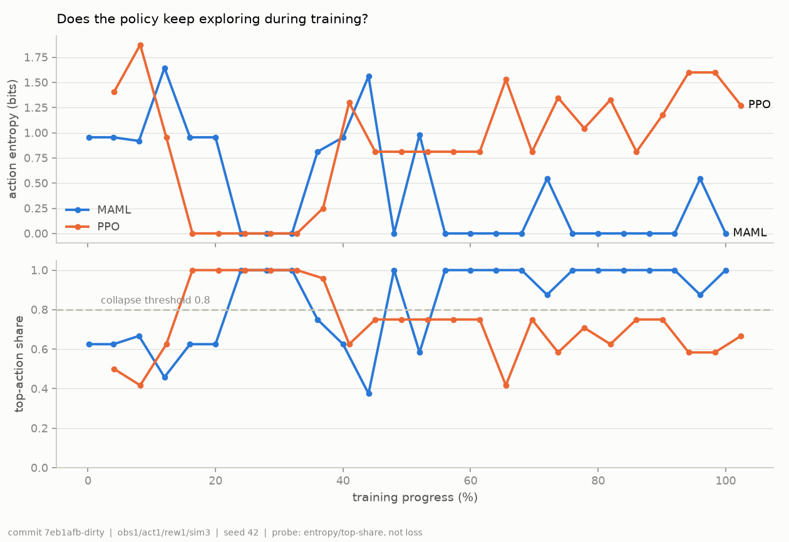

# 고도화 계획서 (ROADMAP) — autonomous-network-mgmt

> 작성일: 2026-09-09
> 선행 문서: `PROJECT_OVERVIEW.md`(구조), `AUDIT_2026-09-09.md`(감사·수정 결과), `FIX_PLAN.md`(2026-09-06 지시서)
> 대상: 이 프로젝트를 "동작하는 연구용 프로토타입"에서 "주장을 뒷받침할 수 있는 시스템"으로 올리기 위한
> 향후 6~12개월 과제. 우선순위는 **현재 결과에서 무엇이 입증되지 않았는가**를 기준으로 정했다.

---

## 0. 출발점 — 지금 무엇이 입증됐고 무엇이 아닌가

두 차례 감사(09-06, 09-09)를 거친 뒤의 정직한 상태다. 고도화는 여기서 출발해야 한다.

| 주장 | 상태 | 근거 |
| --- | --- | --- |
| 폐쇄 루프가 혼잡 링크를 첫 사이클에 식별하고 자동 복구한다 | **입증** (시뮬레이션 내) | stress 50 ep: RCA 100%, 성공 100%, TTR 6.88 (sim_v3; 물리 하한 4틱 + 관측 지연) |
| 복구 성능의 동인은 Analytics(RCA) 계층이다 | **입증** | 절제: analytics_only 7.08 ≈ combined 7.00, 부수 피해 0.00 vs 0.68 (sim_v3에서도 유지) |
| MAML few-shot 에이전트가 복구에 기여한다 | **반증** — 현재 기여는 음(−) | combined는 TTR 이득 없이 정상 링크만 건드림 |
| PPO/MAML이 상태에 따라 링크를 고르는 정책을 학습했다 | **반증** | MAML은 sim_v3에서도 상수(P8). PPO는 sim_v3에서 붕괴를 벗어났으나 TEST 링크 성공률 0% — §6 참고 |
| 14차원 관측만으로 장애 링크를 특정할 수 있다 | **입증** (2026-10-07) | "지연 상위 2개 노드를 잇는 링크" 규칙이 6개 링크 전부 100% — 학습·적응 없음 (§8) |
| **이 환경에 학습이 필요하다** | **반증** (2026-10-07) | 위 규칙이 미학습 링크까지 100%. 최고 상수 행동은 25%이므로 상태는 봐야 하지만 **적응할 것이 없다** (§8) |
| 붕괴의 원인이 baseline·엔트로피에 있다 | **반증** (2026-10-06) | 둘 다 적용해도 MAML 4변종 전부 붕괴. V(s)를 켠 쪽이 오히려 더 일찍(16% vs 24%) — §7, §8 |
| 노드를 늘리면 학습의 자리가 생긴다 | **반증** (2026-10-07) | 8노드·장애 1건에서 휴리스틱 적중 1.000 (K4보다 높다). **동시 다중 장애**가 있어야 깨진다 — §8 B-측정 |
| 트래픽 공격 탐지기가 실데이터에서 유용하다 | **미입증** | CICDDoS2019 F1 0.56 < 전부-공격 베이스라인 0.72 |
| OSPF 인증·위조 탐지 | 규칙 기반으로 **동작** | 자가 테스트 4종 통과. ML 없음 |
| Java 마이크로서비스 경로(A) | 컴파일만 검증 | Kafka 실기동 미검증 |
| 실제 네트워크(Mininet/OSPF 데몬)에서 동작 | **없음** | `topology.py`는 미사용 참조 구현 |

핵심 진단: **"AI 기반 자율 복구"라는 이름과 달리 지금 일하는 것은 규칙 기반 Analytics다.** RL 계층이
의미를 가지려면 (1) 에이전트가 링크를 특정할 수 있는 관측, (2) 행동 차이가 보상 차이로 이어지는
학습 신호, (3) 규칙이 못 푸는 시나리오가 필요하다.

> **2026-10-07 갱신 — 세 가지를 전부 측정했고, 진단이 틀렸던 부분이 있다.**
>
> - **(1)은 이미 있었다.** 관측만 쓰는 한 줄 규칙이 6개 링크 전부 100%로 푼다 (§8). 관측이
>   부족한 것이 아니다 — 오히려 충분해서 학습이 필요 없다
> - **(2)는 확인됐다.** advantage가 행동보다 상태를 23.8배 더 반영한다 (§7). 다만 그 원인으로
>   지목한 baseline·엔트로피를 고쳐도 붕괴는 남았다 (§8)
> - **(3)이 결정적이다.** 규칙이 못 푸는 시나리오가 없는 게 아니라, **규칙이 전부 푼다.**
>   커리큘럼·보상·baseline을 어떻게 고쳐도 이 사실은 안 바뀐다
>
> 결론: 이 환경은 "RL이 잘 안 되는 환경"이 아니라 **"RL이 필요 없는 환경"**이다. 학습 쪽
> 과제(Track A)를 더 파는 것은 의미가 없고, 문제 자체를 바꾸는 것(Track B)이 선행되어야 한다.

---

## 1. 원칙

`FIX_PLAN.md` §0.2를 계승한다. 고도화 과정에서도:

1. 지표가 좋아 보이도록 임계치·하이퍼파라미터를 조정하지 않는다. 조정하면 전/후를 모두 기록한다.
2. 결과 파일은 스크립트 출력으로만 갱신한다. 이전 결과는 `*_pre_<태그>.json`으로 보존한다.
3. 개선이 있어도 기존 한계 서술을 지우지 않는다.
4. **새 기능마다 "이것이 없으면 못 푸는 시나리오"를 먼저 정의한다.** 규칙으로 100% 풀리는 문제에
   학습 모델을 얹는 것은 기여가 아니다 (절제 실험이 이미 보여줬다).
5. 관측·행동·보상 등 계약을 바꿀 때는 버전을 붙인다(`obs_v2`, `action_v2`). 구 체크포인트와 결과는
   구 버전으로 남긴다.
6. 측정 방법을 먼저 고정하고 모델을 바꾼다 (P1의 교훈: 자를 바꾸면 모든 수치가 무효가 된다).

---

## 2. 트랙별 과제

### Track A — RL 계층의 의미 회복 (최우선)

**문제.** 세 정책 전부 상수 행동(P8). 오프라인 평가·절제 실험의 RL 관련 수치는 정책 품질을 재지 못한다.

**원인 분석 (코드 기준).**

| 원인 | 위치 | 설명 |
| --- | --- | --- |
| 관측이 링크를 특정하지 못함 | `network_env.py` 관측 14차원 = 노드 bw×4, lat×4, cost×6 | 링크 스트레스는 인접 노드 평균으로만 보인다. r3-r4 혼잡과 r3·r4 각각의 다른 링크 혼잡을 구분하려면 노드 쌍 패턴을 학습해야 하는데 신호가 약하다 |
| 학습 중 행동이 보상을 바꾸는 스텝이 드묾 | `ANOMALY_PROB = 0.03`, 최대 2개 동시 | 200스텝 에피소드에서 이상은 평균 6회 시작. 나머지 스텝은 어떤 행동이든 보상이 거의 같다 |
| 행동 비용이 없음 | `reward.py` | 정상 링크의 cost를 바꿔도 패널티가 없다. 상수 행동이 손해 보지 않는다 |
| NO-OP 없음 | 행동 30개 전부 cost 변경 | "아무것도 하지 않음"을 표현할 수 없어 정상 상태에서도 교란한다 (P7) |
| MAML 태스크 분포가 사실상 하나 | `train()`이 같은 env로 4 태스크 | 태스크 간 차이가 링크 선택뿐이라 meta-learning의 전제(태스크 분포)가 약하다 |

**과제.**

| ID | 과제 | 구체 변경 | 완료 기준 |
| --- | --- | --- | --- |
| A-1 | 관측 v2: 링크 단위 지표 추가 | 관측에 링크별 이용률(또는 SNMP `ifInOctets` 대응값) 6개 추가 → 20차원. 실제 SNMP는 인터페이스 단위이므로 현실성 훼손이 아니다. `obs_version` 필드로 v1/v2 구분 | `NetworkEnv(obs_version=2)`, `/action` 페이로드에 `linkUtil` 선택 필드, v1 호환 유지 |
| A-2 | 행동 v2: NO-OP 추가 | `Discrete(31)`, 인덱스 30 = 무행동. `action_version` 명시. 폐쇄 루프는 이미 "이상 없으면 무행동"이므로 오프라인 경로만 영향 | 오프라인 평가에서 정상 상태 스텝의 cost 변경률 < 5% |
| A-3 | 보상 v2: 행동 비용 + 부수 피해 패널티 | `R -= w_act × 1[cost 변경]`, `R -= w_side × (정상 링크 변경 수)`. 가중치는 **한 번 정하고 고정**, 전/후 기록 | 상수 정책의 보상이 no-op 정책보다 낮아짐을 자가 테스트로 확인 |
| A-4 | 학습 커리큘럼 | 에피소드 시작 시 혼잡 1개 확정 주입 + 확률적 추가 주입, 에피소드 길이 50. "행동이 보상을 바꾸는" 스텝 비율 ≥ 50% | 학습 로그에 anomaly-active 스텝 비율 출력 |
| A-5 | 정책 붕괴 게이트 | `policy_collapse_check.py`를 학습 파이프라인 마지막 단계로 편입. 상수 비율 > 80%면 체크포인트를 "붕괴"로 표시하고 결과 문서에 자동 기록 | 모든 결과 JSON에 `policy_entropy`, `top_action_share` 포함 |
| A-6 | 규칙이 못 푸는 시나리오 도입 | (a) 동시 혼잡 2~3개 (RCA 폴백 규칙이 추정에 그치는 영역), (b) cost 변경이 다른 링크로 혼잡을 옮기는 용량 제약(Track B-2), (c) 노이즈 큰 관측 | 각 시나리오에서 analytics_only 성공률 < 100%가 되어야 RL 기여를 측정할 공간이 생긴다 |
| A-7 | 공정 비교 프로토콜 | PPO·MAML을 같은 obs/action/reward v2, 같은 seed 5개, 같은 스텝 예산으로 학습. 오프라인·폐쇄 루프 각각에서 analytics_only / +PPO / +MAML 절제. 지표: TTR, 성공률, 부수 피해, 상수 비율 | seed 5개 평균±표준편차로 보고. 단일 seed 수치 금지 |

**예상 결과에 대한 솔직한 전망.** A-1~A-4를 해도 단일 혼잡 시나리오에서는 규칙(RCA)이 계속 이길
가능성이 높다. RL의 자리는 A-6의 "규칙이 모호한" 영역이다. 거기서도 이득이 없으면 RL 계층을 제거하고
Analytics 중심 시스템으로 재포지셔닝하는 것이 정직한 결론이며, 그 결론도 기여다.

### Track B — 시뮬레이터 현실성

**문제.** 정답 행동(cost ≥ 100 → 즉시 격리)이 코딩되어 있고, 용량·방향·트래픽 매트릭스가 없다.
분석 계층이 100%인 것은 이 단순함의 결과다.

| ID | 과제 | 구체 변경 | 완료 기준 |
| --- | --- | --- | --- |
| B-1 | 트래픽 매트릭스 + 최단경로 라우팅 | 노드 쌍별 수요 행렬, OSPF cost로 Dijkstra 경로 계산, 링크 부하 = 경로가 지나는 수요의 합. 지금의 "cost 역수 비율" 근사를 대체 | cost 변경이 **다른 링크의 부하를 올리는** 부작용이 재현됨 |
| B-2 | 링크 용량 | 링크별 용량(Mbps), 이용률 = 부하/용량, 스트레스는 이용률의 함수. 우회가 항상 공짜가 아니게 됨 | 우회 경로가 포화되는 시나리오 존재 |
| B-3 | 다중 동시 이벤트 | 혼잡 2~3개, 혼잡 + 공격, 링크 다운(용량 0) | RCA 폴백 규칙의 정확도를 처음으로 측정 |
| B-4 | 관측 지연·손실 | SNMP 폴링 주기 모사(관측이 n틱 지연), 관측 누락 확률 | 503 처리 경로(A4)가 실제로 쓰임 |
| B-5 | 시뮬레이터 자가 테스트 확장 | 시정수, 용량 포화, 라우팅 정합성 등을 `metric_generator.py __main__`에 추가 | 자가 테스트가 회귀를 잡음 |
| B-6 | Mininet + FRR(OSPF 데몬) 실연동 | `topology.py`를 OVS 스위치가 아닌 FRR 라우터 컨테이너로 재작성. `MininetClient.setOspfCost`가 실제 `vtysh` 명령으로 cost 변경. 메트릭은 실제 인터페이스 카운터 | 실제 OSPF 재수렴 시간이 TTR에 포함됨. Linux 전용, Docker `privileged` |

B-1~B-3은 Python만으로 가능하고 Track A의 전제다. B-6은 별도 마일스톤(Phase 3).

### Track C — 트래픽 공격 탐지기의 실데이터 유효성

**문제.** F1 0.56 < 베이스라인 0.72. 원인은 피처(문서화됨)와 모델 구조(P4) 둘 다.

| ID | 과제 | 구체 변경 | 완료 기준 |
| --- | --- | --- | --- |
| C-1 | `Flow Duration == 0` 플로우 처리 | 제외 대신 "패킷 수 / 최소 시간 단위"로 전송률 추정하거나 별도 피처(`zero_duration_flow_count`)로 분리 | 제외 플로우 0건, 결과 전/후 병기 |
| C-2 | 대체 피처 | `syn_ratio`(죽은 피처) 대신 단방향 플로우 비율(`bwd_packets == 0`), 플로우 수/초, 평균 플로우 길이. `update()/detect()` 6인자 시그니처는 v1으로 유지하고 v2 API 추가 | 피처별 단변량 AUC 보고 |
| C-3 | 지도학습 베이스라인 | 로지스틱 회귀·GBM을 같은 윈도우 피처로 학습(시간 순 분할: 앞 70% 학습, 뒤 30% 평가). 비지도 IF가 이 베이스라인과 얼마나 차이 나는지 보고 | 결과 표에 IF / LR / GBM / 전부-공격 4행 |
| C-4 | 온라인 학습 게이팅 | `is_threat=True`로 판정한 샘플은 학습 버퍼에 넣지 않음(자기 강화 방지). contamination은 데이터의 추정 base rate로 설정하되 **전/후 기록** | 지속 공격 200윈도우 후에도 탐지율 유지 (시뮬레이션으로 검증) |
| C-5 | 데이터셋 확장 | CICDDoS2019 다른 공격일 CSV, CIC-IDS2017(포트스캔 포함) — 포트스캔 분기의 첫 실검증 | 공격 유형별 혼동 행렬 |
| C-6 | 재현 자동화 | 데이터 준비 스크립트 + 결과 파일 스키마 버전(`schema_version`) | `python validate_security_detector.py --all` 한 번으로 전 표 재생성 |

### Track D — 운영 파이프라인

| ID | 과제 | 구체 변경 | 완료 기준 |
| --- | --- | --- | --- |
| D-1 | Java 경로 실기동 검증 | Docker Compose로 Kafka + 시뮬레이터(`SIM_CLOCK=realtime:1000`) + collector + orchestrator + AI 엔진 기동, 혼잡 주입 → cost 변경까지 E2E | compose 프로파일 `e2e`, 검증 스크립트가 30초 내 cost 변경 확인 |
| D-2 | 제어 경로 단일화 | (A) Java 경로가 `/action`(단건) 대신 `/auto-step`을 호출하거나, (B) `/auto-step`의 Orient·Decide 로직을 라이브러리로 분리해 두 경로가 공유. 현재는 같은 목적의 루프가 두 벌(§3.2 OVERVIEW) | 절제 실험 결과가 두 경로에서 같음 |
| D-3 | 메트릭·결정 이력 저장 | PostgreSQL 재도입(이번엔 코드와 함께): 관측, 진단, 행동, 결과를 시계열로 저장. 대시보드 라이브화의 전제 | `/history?from=&to=` API |
| D-4 | 대시보드 라이브화 | 정적 데모 대신 `/live-results`·`/history`를 읽는 프런트. 정적 버전은 GitHub Pages용으로 유지 | 라이브/정적 빌드 분리 |

> 도판·대시보드 작업의 상세 계획은 `cowork/VISUALIZATION_PLAN.md`에 있다. 특히 현재 대시보드가
> 철회된 수치(TTR 3.78, 랜덤 정책 베이스라인, 샘플 효율 곡선)를 렌더링하고 있다는 점을 다룬다.
| D-5 | 관측성 | 구조화 로그(JSON), 사이클별 지연·실패 카운터, `/metrics`(Prometheus) | 503·apply 실패가 카운터로 보임 |
| D-6 | 접근 제어 | `/debug/*`·`/reset-buffer`에 토큰, CORS 화이트리스트, OSPF 키를 환경변수/키스토어로 | README 보안 범위 절 갱신 |

### Track E — 품질 인프라

| ID | 과제 | 구체 변경 | 완료 기준 |
| --- | --- | --- | --- |
| E-1 | 자가 테스트 러너 | `scripts/selftest.sh`: `metric_generator`, `anomaly_detector`, `topology`, `ospf_security`, `cicddos_loader` `__main__` 순차 실행 + `policy_collapse_check` + `mvn -q compile`. pytest 도입은 owner 결정 사항 | 한 명령으로 전부 통과/실패 |
| E-2 | CI | GitHub Actions: E-1 + FastAPI TestClient로 `/auto-step` 503 경로·정상 경로 스모크. 학습·실험은 CI 밖 | PR마다 실행 |
| E-3 | 재현 파이프라인 | `experiments/reproduce.sh`: MAML/PPO 학습(seed 목록) → 오프라인 평가 → 서버 기동 → 폐쇄 루프 3종 → 결과 요약 표 생성. 이번 세션의 임시 `pipeline.sh`를 정식화 | README의 모든 수치가 이 스크립트 출력과 일치 |
| E-4 | 결과 파일 규약 | 모든 결과 JSON에 `schema_version`, `_condition`, `seed`, `git_commit`, `obs/action/reward_version` | 결과 파일만 보고 측정 조건을 알 수 있음 |
| E-5 | 체크포인트 관리 | 체크포인트 파일명에 버전·날짜·커밋(`maml_v2_20261001_abc123.pt`), `agents/MANIFEST.md`에 학습 조건 기록. 운영 체크포인트 심볼릭 이름은 매니페스트로 해석 | 체크포인트-결과-커밋 추적 가능 |

### Track F — 연구 포지셔닝

현재 데이터로 정직하게 주장할 수 있는 것과 없는 것을 분리한다.

| 주장 가능 (지금) | 주장하려면 필요한 것 |
| --- | --- |
| ETSI ZSM 폐쇄 루프(Observe–Orient–Decide–Act–Evaluate)의 참조 구현과 절제 실험 방법론 | — |
| 인접도 기반 RCA가 단일 혼잡을 첫 사이클에 100% 식별 (시뮬레이션) | 다중 혼잡·용량 제약(B-1~B-3)에서의 정확도 |
| "RL 계층의 기여를 절제 실험으로 분리해 음(−)임을 확인" — 부정적 결과 자체가 기여 | — |
| OSPF 인증 우회 시나리오 3종의 규칙 기반 탐지 | ML 시퀀스 모델과의 비교 |
| 측정 방법론 결함(관측 주도 시간, 첫 사이클만 재는 RCA 정확도)의 발견과 수정 | — |
| MAML few-shot 적응의 이점 | Track A 전부 + A-6 시나리오에서 유의한 이득 |
| 실데이터 DDoS 탐지 | Track C-1~C-4에서 베이스라인 초과 |

---

## 3. 단계별 로드맵

### Phase 1 (1~2개월) — 자를 고정하고 학습 문제를 풀 수 있게 만든다

- E-1, E-3, E-4 (측정·재현 인프라 먼저)
- B-1, B-2, B-3 (시뮬레이터에 트래픽 매트릭스·용량·다중 이벤트)
- A-1, A-2, A-3, A-4, A-5 (관측/행동/보상 v2, 커리큘럼, 붕괴 게이트)
- C-1, C-4 (탐지기의 가장 큰 누수와 자기 강화 차단)

**완료 기준**: `reproduce.sh` 한 번으로 모든 표가 재생성되고, 학습된 정책의 상수 비율이 80% 아래로
내려가며, 다중 혼잡 시나리오에서 analytics_only 성공률이 100% 미만인(=RL이 기여할 공간이 있는)
벤치마크가 존재한다.

### Phase 2 (3~4개월) — 기여를 측정한다

- A-6, A-7 (규칙이 모호한 시나리오에서 seed 5개 공정 비교)
- C-2, C-3, C-5 (피처 재설계, 지도학습 베이스라인, 포트스캔 실검증)
- D-1, D-2 (Java 경로 E2E, 제어 경로 단일화)
- E-2 (CI)

**완료 기준**: RL 계층의 기여가 유의하게 양(+)이거나, 아니면 RL 계층 제거 결정. 탐지기가
전부-공격 베이스라인을 넘거나, 아니면 "비지도 IF는 이 문제에 부적합"을 지도학습 대비로 결론.
어느 쪽이든 문서에 기록.

### Phase 3 (5~6개월+) — 실제 네트워크

- B-6 (Mininet + FRR OSPF 실연동), B-4 (관측 지연)
- D-3, D-4, D-5, D-6 (이력 저장, 라이브 대시보드, 관측성, 접근 제어)
- 실제 SDN 컨트롤러 연동으로 OpenFlow 차단 룰 실제 적용 (현재는 반환만)

**완료 기준**: 실제 OSPF 재수렴을 포함한 TTR(초 단위)이 측정되고, 시뮬레이션 TTR과의 관계가 문서화됨.

---

## 4. 리스크와 대응

| 리스크 | 대응 |
| --- | --- |
| Track A를 다 해도 RL이 규칙을 못 이김 | 그것이 결론이면 그대로 발표. Analytics 중심으로 재포지셔닝(Track F). 시간 상한: Phase 2 종료 |
| 관측/행동/보상 v2가 이전 결과를 전부 무효화 | 버전 태그로 공존. v1 결과는 `*_v1` 로 보존하고 README에 병기 |
| 시뮬레이터가 복잡해지며 "정답이 코딩된" 문제가 다른 형태로 재발 | 새 시뮬레이터마다 "규칙 기반 최적 정책"을 먼저 구현하고 그 성능을 상한선으로 보고 |
| 실데이터 확장 시 데이터 접근 제약(UNB 가입, 용량) | 준비 스크립트 + 체크섬으로 재현성 확보, 데이터 자체는 커밋 금지 |
| Mininet/FRR은 Linux 전용, 개발 환경(Windows)과 불일치 | Docker `privileged` 컨테이너로 격리, CI는 시뮬레이션만 |
| 하나의 실험 세션이 길어 재현이 부담 | `reproduce.sh`에 `--quick`(seed 1, 10 ep) 모드 |

---

## 5. 당장 시작할 수 있는 것 (의존성 없음, 각 반나절 이내)

1. **E-1 자가 테스트 러너** — 이미 있는 `__main__` 테스트 5개 + 붕괴 검사 + `mvn compile`을 스크립트 하나로.
2. **E-4 결과 파일 규약** — 실험 스크립트 3종 + `run_experiment.py`에 `git_commit`·`schema_version` 필드 추가.
3. **A-5 붕괴 게이트** — `few_shot_agent.py --train` 끝에 `policy_collapse_check` 호출, 결과를 학습 로그와 체크포인트 옆 `*.meta.json`에 기록.
4. **B-1 트래픽 매트릭스** — `metric_generator._compute_link_traffic()`를 Dijkstra 기반으로 교체. 자가 테스트에 "cost를 올리면 우회 경로 부하가 오른다" 추가.
5. **C-1 zero-duration 플로우** — `cicddos_loader._compute_pkt_rate()`에 처리 모드 추가, 결과 전/후 병기.

이 다섯 개가 끝나면 Phase 1의 나머지(관측/행동/보상 v2)를 같은 자로 잴 수 있다.

---

## 6. 진행 기록

### 2026-09-09 — §5의 다섯 과제 완료 + E-3

| ID | 산출물 | 상태 |
| --- | --- | --- |
| E-1 | `scripts/selftest.sh` | 완료 — 모듈 자가 테스트 6종 + compileall + 붕괴 검사 + `mvn compile` |
| E-3 | `experiments/reproduce.sh` | 완료 — 학습 → 오프라인 평가 → 폐쇄 루프 3종 → 요약 |
| E-4 | `experiments/_resultmeta.py` | 완료 — 모든 결과 JSON에 `schema_version`/`git_commit`/`seed`/계약 버전 |
| A-5 | `ai-engine/policy_check.py` | 완료 — 학습 직후 자동 검사, `<체크포인트>.meta.json` |
| C-1 | `cicddos_loader` zero-duration 모드 | 코드 완료, **실데이터 미측정** (CSV 부재) |
| B-1 | 수요 행렬 + 최단경로(ECMP) 라우팅 | 완료 — `SIM_VERSION = 3` |

> **2026-09-13 갱신**: 시뮬레이터 난수까지 시드하도록 고친 뒤(아래 5번) 재측정한 값은
> stress 6.88 / 절제 7.08·13.86·7.00 / 오프라인 PPO 200.0·MAML 101.93이다. 결론은 같고
> 이제 **재현 가능하다**. 도판은 `experiments/figures/out/`.

**측정 결과 (sim_v2 → sim_v3, 50 ep, seed 42, TEST 링크 held-out)**

| 실험 | sim_v2 | sim_v3 |
| --- | --- | --- |
| stress | TTR 6.84, 부수피해 0.80/ep | **6.86** (TEST 6.75 / TRAIN 7.06), 0.80/ep |
| 절제 analytics_only | 6.94 / 100% / 0.00 | **7.08 / 100% / 0.00** |
| 절제 maml_only | 13.80 / 14% | **13.86 / 14%** |
| 절제 combined | 6.94 / 100% / 0.86 | **6.90 / 100% / 0.86** |
| 지속 버퍼 | 6.93 (초기 7.00 → 후기 6.87) | **7.10 (7.27 → 6.93)** |
| 오프라인 PPO | 101.8 / 50% | **200.0 / 0%** |
| 오프라인 MAML | 101.8 / 50% | **101.81 / 50%** |

### 이번에 새로 확인된 것

1. **우회에 대가를 만들어도 폐쇄 루프 수치는 그대로다.** TTR을 결정하는 것은 혼잡 링크 격리와
   감쇠 대기이고, 우회 부하가 이웃 링크에 주는 부담은 TTR을 움직일 만큼 크지 않다.
   절제 결론(복구는 Analytics가 한다)이 "우회가 공짜가 아닌" 시뮬레이터에서도 유지된다.

2. **PPO의 정책 붕괴는 B-1로 풀렸다 — 그러나 문제는 안 풀렸다.** sim_v3 PPO는 서로 다른 행동
   6개, 최빈 비율 0.65, 엔트로피 1.70 bit로 붕괴 판정을 통과한다(sim_v2에서는 비율 1.00).
   그런데 오프라인 성공률은 50% → **0%** 로 떨어진다. 그 행동들 중에 TEST 링크가 필요로 하는
   것이 없기 때문이다. **"붕괴하지 않은 정책"과 "푸는 정책"은 다르다** — P8의 해결 기준을
   상수 비율만으로 잡으면 안 된다는 뜻이고, A-1(관측이 링크를 특정)이 여전히 핵심이다.

3. **MAML은 sim_v3에서도 완전 붕괴다** (비율 1.00, 엔트로피 0, `r3-r4@100`). 오프라인 성공률
   50%는 TEST 링크 둘 중 `r3-r4`가 그 상수와 우연히 일치하는 비율일 뿐이다.

4. **학습/평가 링크 누수 (신규 결함, 수정 완료).** `reproduce.sh`가 에이전트 스크립트를 직접
   호출해 `train_links=None`이 되면서 TEST 링크까지 학습에 들어갔다. 누수 상태에서는 PPO·MAML이
   둘 다 ~101.8로 **동등해 보였고**, 링크를 실제로 분리하자 200.0 vs 101.81로 갈렸다.
   A-5가 남긴 `train_links: null` 기록이 이 결함을 드러냈다 — 측정 인프라가 곧바로 값을 했다.
   AUDIT §3.5의 오프라인 수치(2026-09-09 감사분)도 같은 방식으로 학습된 체크포인트를 잰 것이라
   링크 분리가 보장되지 않는다.

### 5. 학습 동역학 — T1이 답한 것 (2026-09-13)

학습 중 정책 행동을 기록하기 시작하자(VISUALIZATION_PLAN T1) 끝점만 보던 때는 보이지 않던
것이 나왔다. **두 정책의 차이는 붕괴 여부가 아니라 회복 능력이다.**

| | 최초 붕괴 | 이후 | 최종 |
| --- | --- | --- | --- |
| **MAML** | iter 120 / 500 (**24%**) | 붕괴·회복을 오가다 iter 260 이후 갇힘 | 엔트로피 0.00, 상수 `r3-r4@100` |
| **PPO** | 8,192 / 50,000 스텝 (**16%**) | 20,480스텝부터 회복해 유지 | 엔트로피 1.27~1.65, 붕괴 아님 |

두 가지를 시사한다.

1. **MAML 학습의 뒤쪽 절반(약 240 iteration)은 이미 죽은 정책 위에서 돈다.** 학습량을 늘리는
   것으로는 해결되지 않는다는 뜻이다.
2. 탐색이 아예 없는 게 아니라 **붕괴 상태에서 빠져나올 유인이 없다.** 상수 행동이 보상 면에서
   손해를 보지 않기 때문이다 — A-4(커리큘럼)보다 **A-3(보상: 행동 비용·부수 피해 패널티)를
   먼저 볼 근거**다.

그리고 **"붕괴하지 않음"은 "푼다"가 아니다.** sim_v3 PPO는 붕괴를 벗어났지만(1.65 bit,
서로 다른 행동 6종) TEST 링크 성공률은 여전히 0%다. A-1(관측이 링크를 특정)이 빠진 한
탐색이 늘어도 갈 곳이 없다.

### 6. 이번에 발견된 결함 — 학습 재현성 (2026-09-13, 수정 완료)

T1의 "프로브가 학습을 방해하지 않는다"를 검증하다가 **기존 결함**을 찾았다. `train()`이
torch·numpy·random은 시드하면서 `metric_generator`의 자체 난수 스트림은 시드하지 않아,
**같은 프로세스에서 같은 seed로 두 번 학습하면 결과가 달랐다.** `run_experiment.py`는 MAML과
PPO를 한 프로세스에서 학습하므로 실제로 영향을 받던 자리다.

`NetworkEnv(sim_seed=)`로 고쳤고, 같은 seed → 동일 체크포인트(해시 일치)임을 확인했다.
프로브도 `metric_generator.snapshot()/restore()`(난수 상태 포함)로 감싸 비침습적임을 확인했다.
2026-09-13 이전 결과는 시뮬레이터 노이즈를 OS 엔트로피에서 뽑았으므로 정확히 재현되지 않는다.

### 7. 붕괴의 원인 (2026-10-06) — T1이 "언제"를 답했고 이것이 "왜"를 답한다

T1은 MAML이 학습의 24% 지점, PPO가 16% 지점에서 붕괴한다는 것을 보여줬다. **후반의 과적합이
아니라 초반**이라는 점이 알고리즘보다 환경·보상을 가리켰다. `experiments/collapse_diagnosis.py`는
학습 알고리즘을 전혀 돌리지 않고 **환경만** 측정한다 — 학습이 쓸 수 있는 신호가 애초에 있는지.

결과 파일: `results/collapse_diagnosis.json`, 도판 T5·T6.

#### 측정된 사실

| | 측정 | 값 |
| --- | --- | --- |
| **D1** | 학습 스텝 중 "고칠 것이 있는" 비율 | **33.2%** (이상이 한 번도 없는 에피소드 **40.3%**) |
| **D2** | 정상 상태에서 30개 행동의 보상 퍼짐 | **0.00012** — 같은 상태의 노이즈(0.0150)의 **1/125** |
| **D2** | 혼잡 상태에서의 퍼짐 | 0.0134, 노이즈 0.0093 → SNR **1.44** |
| **D3** | 혼잡 상태의 최적 행동 | 네 링크 모두 **정답 행동이 1위/30** |
| **D4** | 올바른 행동 후 보상이 1σ 분리되기까지 | **1틱** (5틱에 ~2σ, 8틱에 5σ) |
| **D5** | advantage 분산 중 '상태'가 설명하는 비율 : '행동'이 설명하는 비율 | **23.8 : 1** |
| **D5** | 현행 신호에서 정답 행동 4종의 순위 | **8, 15, 16, 18위 / 30** (무작위와 구별 불가) |
| **D5** | 정규화 후 \|advantage\| 평균 — 이상 없는 에피소드 vs 있는 에피소드 | **0.804 vs 0.821** (사실상 동일) |

#### 인과 사슬

보상 지형 자체는 **옳다.** D3이 보여주듯 고칠 것이 있을 때 정답 행동이 1위다. 문제는 그
신호가 학습에 도달하기 전에 묻힌다는 것이다.

1. **학습 스텝의 2/3는 고칠 것이 없는 상태다** (D1). 그 상태에서 30개 행동의 보상 차이는
   노이즈의 1/125 — 즉 **행동이 보상에 아무 영향도 주지 않는다** (D2).
2. **보상은 상태에 따라 크게 달라진다.** 정상 0.681 / 혼잡 0.323 — 차이 **0.358**. 반면
   행동이 만드는 차이는 최대 0.0134. **28배**다.
3. `_reinforce_loss`의 baseline은 **에피소드 보상 평균이라는 스칼라 하나**다. 스칼라는
   상태에 따른 보상 차이를 제거할 수 없다. 그래서 advantage는 "무슨 행동을 했는가"가 아니라
   **"어떤 상태에 있었는가"를 23.8배 더 반영한다** (D5).
4. 정상 상태는 보상이 높으므로, **정상 상태에서 우연히 뽑힌 행동이 큰 양의 advantage로
   강화된다.** 어떤 행동이었는지는 상관없다. 이것이 상태와 무관한 상수 정책이다.
5. 게다가 advantage는 표준편차로 나뉜다. **이상이 한 번도 없는 40%의 에피소드**에서는 보상이
   노이즈뿐인데, 정규화가 그 노이즈를 단위 분산으로 **증폭**해 신호가 있는 에피소드와 같은
   크기의 gradient를 만든다 (D5: 0.804 vs 0.821). 정규화가 "신호 없음"과 "신호 있음"을
   구별하지 못하게 만든다.

#### 이 설명은 두 알고리즘의 **차이**까지 예측한다

기전이 맞다면 **학습된 상태가치 baseline이 있는 알고리즘은 빠져나올 수 있어야 한다.**

- PPO는 `V(s)`를 학습한다 → 상태에 따른 보상 차이가 advantage에서 제거된다
- MAML의 REINFORCE는 스칼라 평균뿐이다 → 제거되지 않는다

T1이 실제로 관측한 것: **PPO는 16%에서 붕괴했다가 회복하고, MAML은 24%에서 붕괴해 끝까지
갇힌다.** 이 진단과 독립적으로 측정된 사실이 기전의 예측과 일치한다.

(둘 다 *붕괴하기는 한* 이유는 따로 있다 — 양쪽 모두 엔트로피 정규화가 없다. PPO는
`ent_coef`를 넘기지 않아 SB3 기본값 0.0이고, `_reinforce_loss`에도 엔트로피 항이 없다.)

#### 수정 방향 — 근거의 세기 순

| 순위 | 과제 | 근거 | 예상 효과 |
| --- | --- | --- | --- |
| 1 | **상태가치 baseline** (REINFORCE → actor-critic, 또는 상태 조건부 baseline) | D5: 23.8:1 → 0:1로 떨어지는 것을 같은 데이터에서 확인 | 기전의 직접 제거. MAML이 갇히는 이유 |
| 2 | **엔트로피 정규화** (`ent_coef` > 0, REINFORCE 손실에 엔트로피 항) | 양쪽 다 0이라는 코드 사실 + 붕괴가 초반에 발생 | 초기 붕괴 자체를 늦춤 |
| 3 | **A-4 커리큘럼** — `reset()`에서 이상을 주입해 "고칠 것이 있는" 상태 비율을 올린다 | D1: 지금은 33.2%, 40.3%의 에피소드는 통째로 무의미 | 신호 밀도를 2~3배로 |
| 4 | **A-3 보상 v2** — 행동 비용·부수 피해 항 | D2: 정상 상태에서 아무 행동이나 해도 보상이 같다(퍼짐 0.00012) | 정상 상태에 "가만히 있으라"는 신호 부여 |
| 5 | **A-1 관측 v2** — 링크별 이용률 | 간접. D3은 현재 관측으로도 최적 행동이 상태별로 다름을 보임 | 신호 자체는 이미 있으므로 후순위 |

**기존 로드맵에서 순위를 내려야 하는 것**: **A-2 NO-OP 행동 단독은 근거가 없다.** 정상
상태에서 엉뚱한 행동을 해도 보상이 사실상 변하지 않으므로(퍼짐 0.00012), NO-OP를 추가하는
것만으로는 아무것도 달라지지 않는다. **4번(행동 비용 항)과 함께일 때만 의미가 있다.**

#### 이 진단이 확정하지 **못한** 것

- **즉시 보상만 쟀다.** D4가 보여주듯 신호는 틱이 지날수록 커지므로, 할인 수익률 기준의
  신호는 여기 측정값보다 크다. PPO(γ=0.99, GAE)는 그 혜택을 받는다
- **균일 무작위 정책에서 쟀다** (학습 초기의 탐색 분포). 학습이 진행된 정책에서의 신호 분해는
  다르다 — 다만 붕괴가 학습 초반에 일어나므로 초기 분포가 관련 구간이다
- **seed 1개.** D1/D2/D4는 반복 24회로 노이즈를 추정했지만 학습 전체의 seed 분산은 아니다 (T3)
- **고치면 나아진다는 증거는 아직 없다.** 위 표는 원인에 대한 설명이지 해법의 검증이 아니다.
  1~4번을 적용한 재학습과 재측정이 남아 있다

### 8. 이 환경에는 학습이 기여할 자리가 없다 (2026-10-07)

§7의 수정 1·2를 적용했는데 MAML 네 변종이 전부 붕괴했다. 세 번째 수정으로 가는 대신 설계로
돌아갔고(`experiments/training_design_audit.py`), 태스크 정의를 고친 뒤 그 설계를 띄우기 전에
검증했다(`experiments/v2_design_check.py`). 거기서 더 근본적인 사실이 나왔다.

#### 학습 없는 한 줄 규칙이 전부 푼다

> **"지연이 가장 높은 두 노드를 잇는 링크에 OSPF cost 100"**

관측 14차원만 쓰고, 학습도 적응도 없는 단일 정책이다.

| 정책 | r1-r2 | r1-r3 | r2-r3 | r2-r4 | r3-r4 | r1-r4 |
| --- | --- | --- | --- | --- | --- | --- |
| 오라클 (장애 링크를 앎) | 100% | 100% | 100% | 100% | 100% | 100% |
| **지연 휴리스틱 (관측만)** | **100%** | **100%** | **100%** | **100%** | **100%** | **100%** |
| 최고 상수 행동 (`r1-r2@100`) | — | — | — | — | — | 평균 25% |

미학습 링크(r3-r4, r1-r4)까지 100%다. 상수 행동은 25%에 그치므로 **상태는 봐야 하지만
적응할 것은 없다.** inner-loop 적응이 기여할 자리가 구조적으로 없다.

이것은 v2 설계의 결함이 아니라 **문제 자체의 성질**이다. 커리큘럼·보상·baseline을 어떻게
고쳐도 바뀌지 않는다. 절제 실험이 "복구를 이끄는 것은 규칙 기반 진단"이라고 보고해 온 이유가
여기서 설명된다 — 규칙이 이기는 게 아니라, **이 문제에 규칙 이상이 필요하지 않다.**

#### 왜 이렇게 쉬운가

K4 토폴로지(4노드·6링크·모든 쌍 직결)에 장애가 **한 번에 하나**다. 혼잡한 링크는 양 끝 노드의
지연을 함께 올리므로, 지연 상위 2개 노드의 교집합이 곧 장애 링크다. 탐색도, 기억도, 적응도
필요 없는 1:1 대응이다. 우회 경로의 선택지도 없다 — 모든 쌍이 직결이라 cost를 올리면 2홉으로
빠지고 끝이다.

#### 선택지

| | 방향 | 뜻 |
| --- | --- | --- |
| **A** | **발견을 그대로 보고하고 주장을 조정** | "이 환경에서는 RL도 메타학습도 불필요하다"를 음성 결과로 기록. 지금까지의 측정과 일관되고, 추가 비용이 없다 |
| **B** | **학습이 기여할 수 있는 문제로 환경을 키운다** | 아래 B-측정 참고. **노드 수만으로는 안 된다** |
| **C** | **학습의 역할을 바꾼다** | "어느 링크를 고칠까"가 아니라 "언제 조치할까"(행동 비용 대비)를 학습. 보상 v2(A-3)가 전제 |

A는 지금 당장 해야 하고, B는 연구를 이어가려면 필요하다. **A 없이 B로 가면 "환경을 어렵게
만들어 학습이 이기게 했다"가 된다** — 그건 이 리포가 피해 온 종류의 결함이다.

#### B-측정: 무엇을 키워야 휴리스틱이 깨지는가 (2026-10-07)

토폴로지를 키우는 것은 OBS/ACTION 계약을 깨고 Java 수집 계층과 대시보드까지 따라와야 하는 큰
변경이다. 짓기 전에 쟀다 (`experiments/topology_scaling_probe.py` — `metric_generator`의 식을
임의 토폴로지로 옮긴 **축소 모형**이며, ECMP 라우팅·트래픽 수요가 없으므로 재측정이 아니라
설계 판단 근거다).

| 구성 | 노드 | 링크 | 동시 장애 | 휴리스틱 적중 | 해결% | 관측 | 행동 |
| --- | --- | --- | --- | --- | --- | --- | --- |
| K4 (현행) | 4 | 6 | 1 | **0.998** | 100.0 | 14 | 30 |
| 6노드 완전그래프 | 6 | 15 | 1 | 0.998 | 100.0 | 27 | 75 |
| 6노드 링+현3 | 6 | 9 | 1 | **1.000** | 100.0 | 21 | 45 |
| 8노드 링+현4 | 8 | 12 | 1 | **1.000** | 100.0 | 28 | 60 |
| K4, 동시 2건 | 4 | 6 | 2 | 0.856 | 95.0 | 14 | 30 |
| 6노드 링+현3, 동시 2건 | 6 | 9 | 2 | 0.917 | 75.0 | 21 | 45 |
| **8노드 링+현4, 동시 2건** | 8 | 12 | 2 | **0.675** | 57.5 | 28 | 60 |
| 8노드 링+현4, 동시 3건 | 8 | 12 | 3 | 0.695 | 20.0 | 28 | 60 |
| 10노드 링+현5, 동시 2건 | 10 | 15 | 2 | **0.588** | 47.5 | 35 | 75 |
| 12노드 링+현6, 동시 3건 | 12 | 18 | 3 | **0.524** | 20.0 | 42 | 90 |

**노드 수만으로는 아무것도 바뀌지 않는다.** 8노드까지 키워도 장애가 하나면 적중률 1.000 —
오히려 K4보다 높다. 혼잡 링크가 양 끝 노드의 지연만 올리는 구조가 그대로이기 때문이다.

**깨뜨리는 것은 동시 다중 장애다.** 장애가 둘 이상이면 지연 상위 2개가 서로 다른 장애에서
올 수 있어 교집합이 정답을 가리키지 않는다. 그리고 **노드가 많을수록 그 효과가 커진다** —
동시 2건에서 K4는 0.856, 8노드는 0.675, 10노드는 0.588.

우회 가능성(`faults_bypassable`)은 모든 구성에서 1.00이다. 즉 어려워지는 원인은 "고칠 길이
없다"가 아니라 **"무엇을 고쳐야 할지 모호하다"**이고, 그것이 학습이 기여할 수 있는 종류의
어려움이다.

**권장 1순위: 8노드 링+현4, 동시 2건.** 휴리스틱이 0.675로 떨어지면서 해결률 57.5%로 여지가
남아 있다. 12노드·동시 3건은 해결률 20%로 너무 어려워 학습이 신호를 못 받을 수 있다.

다만 이것도 축소 모형의 수치다. 실제로 가려면 운영 시뮬레이터에 토폴로지를 반영한 뒤
**같은 휴리스틱 측정을 다시** 해야 한다 — 그게 B의 첫 과제다.

#### 함께 확인한 것

- **조치 링크는 상관있다** (V-1). 장애 링크 우회 0.513 vs 엉뚱한 링크 0.321, 차이 0.193에
  노이즈 0.0076 — 25배. v2 학습 초기에 `r1-r4@100`으로 쏠린 것은 환경이 무차별해서가 아니라
  **학습 안 된 초기화의 argmax**였다
- **적응은 아무것도 바꾸지 못한다** (V-2b). 기존 체크포인트로 `adapt_steps` 0과 3이 여섯 링크
  전부 동일. 붕괴한 상수 정책이니 당연하지만 기록해 둔다

#### v2 설계에서 내가 틀린 것 두 가지 (수정 완료)

| | 문제 | 수정 |
| --- | --- | --- |
| **V-3** | "커리큘럼을 맞췄다"고 했는데 아니었다 — MAML 30스텝 / PPO 200스텝, 링크 커버리지도 MAML만 균등 | PPO의 `max_steps`를 `episode_steps`로, `inject_on_reset`을 무작위에서 **균등 순회**로 |
| **V-4** | 희석이 사라진 게 아니라 자리를 옮겼다 — v1은 장애 **전**이 비고, v2는 고친 **후**가 빈다. 오라클 기준 유효 스텝 13.9%로 v1(33.2%)보다 나쁘다 | 에피소드 길이를 **측정으로** 선택 (아래) |

**에피소드 길이를 8로 정한 근거** (`v2_design_check.py` V-5):

| 길이 | 6 | **8** | 10 | 12 | 16 | 20 | 30 |
| --- | --- | --- | --- | --- | --- | --- | --- |
| 오라클 유효 스텝 % | 70.8 | **51.0** | 47.5 | 41.0 | 26.6 | 22.1 | 13.9 |
| 오라클 해결률 % | 83.3 | **100** | 100 | 100 | 100 | 100 | 100 |

기준은 "오라클 해결률 95% 이상을 유지하는 길이 중 유효 비율이 가장 높은 것"이고, **정책 성능이
아니라 환경의 성질로만** 골랐다. 6은 회복을 끝낼 시간이 부족하다(83.3%).

**"성공하면 에피소드 종료"로 고치지 않은 이유**: 보상이 스텝마다 양수라 일찍 끝낼수록 총 보상이
줄어든다 — **고치지 않는 쪽이 이득이 되는 보상 구조**가 만들어진다. 길이를 줄이는 쪽은 그
병리를 만들지 않는다.

### 다음 (Phase 1 잔여)

- **붕괴 원인 수정** — 위 표의 1~4번. 1·2번은 알고리즘 쪽이라 환경 계약(`OBS_VERSION` 등)을
  건드리지 않고 먼저 시도할 수 있다. 3·4번은 `REWARD_VERSION`/환경 변경이므로 이전 결과와
  직접 비교 불가 — 전/후를 병기한다
- **A-1 관측 v2** (링크별 이용률 6개 추가)
- **A-2 NO-OP 행동**은 A-3와 묶어서 (위 §7 참고)
- **B-2 링크 용량**, **B-3 다중 동시 이벤트** — 규칙이 모호해지는 영역을 만들어야 RL 기여를 잴 수 있다
- **C-1 실측** — CICDDoS2019 CSV를 두 모드(`window_rate` / `exclude`)로 각각 돌려 F1 비교
- **E-2 CI**, **E-5 체크포인트 매니페스트**
